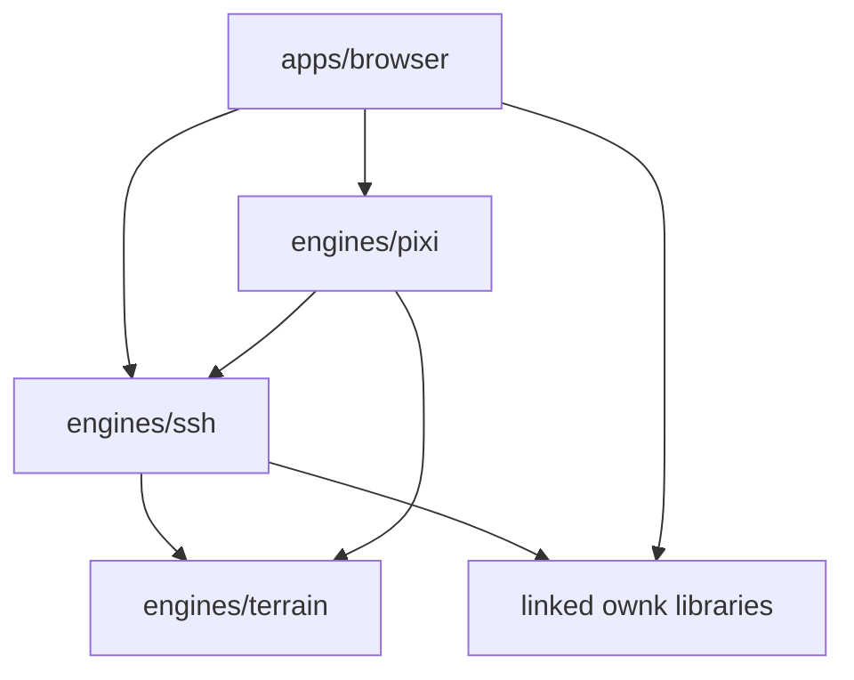

# Architecture Overview

## System Shape

Anarkai is split into a playable client plus three focused engines:

- `apps/browser` presents the game and editor-style panels
- `engines/ssh` owns gameplay state and simulation
- `engines/pixi` renders the world and entities
- `engines/terrain` generates terrain data used by both gameplay and rendering

## Dependency Outline

## Responsibilities

### `engines/terrain`

Pure terrain data generation:

- tile fields
- hydrology
- biome hints
- streamed snapshot merge/prune operations

### `engines/ssh`

Gameplay and persistence:

- board and tile content
- hive and alveolus logic
- worker behavior and job selection
- storage reservation/allocation semantics
- save/load and streamed gameplay frontier management

### `engines/pixi`

Visual ownership:

- continuous terrain sectors
- entity visuals
- renderer diagnostics
- visibility-driven requests for more world data

### `apps/browser`

User-facing integration:

- application shell
- inspector widgets
- palette controls
- selection-follow behavior

## Current Tension

The architecture is healthiest at the terrain seam and the weakest at the gameplay streaming seam.

`engine-terrain` already behaves like an open-ended streamed world. `ssh` and `pixi` are close, but gameplay frontier ownership still needs to be made more explicit so rendering interest does not become gameplay policy.
