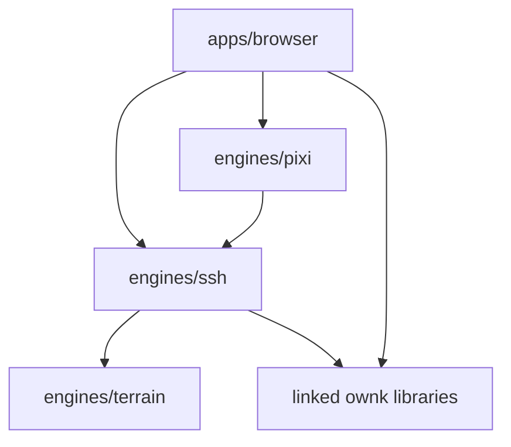

# Architecture Overview

## System Shape

Anarkai is split into a playable client plus three focused engines:

- `apps/browser` presents the game and editor-style panels
- `engines/ssh` owns gameplay state and simulation
- `engines/pixi` renders the world and entities
- `engines/terrain` generates terrain data consumed at runtime by `ssh`

## Dependency Outline

## Responsibilities

### `engines/terrain`

Pure terrain data generation:

- tile fields
- hydrology
- biome hints
- streamed snapshot merge/prune operations

### `engines/ssh`

Gameplay and persistence:

- board and tile content
- hive and alveolus logic
- worker behavior and job selection
- freight-line transport bridge (`gather` / `distribute`, stop matching, compatibility)
- storage reservation/allocation semantics
- save/load and streamed gameplay frontier management

### `engines/pixi`

Visual ownership:

- continuous terrain sectors
- entity visuals
- renderer diagnostics
- visibility-driven requests for more world data
- no runtime terrain generation or private terrain snapshot ownership

### `apps/browser`

User-facing integration:

- application shell
- inspector widgets
- palette controls
- selection-follow behavior

## Runtime Terrain Flow

1. `engine-pixi` computes the visible tile set from the camera.
2. `engine-pixi` checks whether SSH has already materialized those tiles.
3. If visible tiles are missing, `engine-pixi` requests gameplay frontier expansion from `ssh`.
4. `ssh` uses `engine-terrain` to materialize authoritative board tiles.
5. `engine-pixi` re-renders from SSH board state only.

This keeps one runtime source of truth for terrain: the SSH board.
