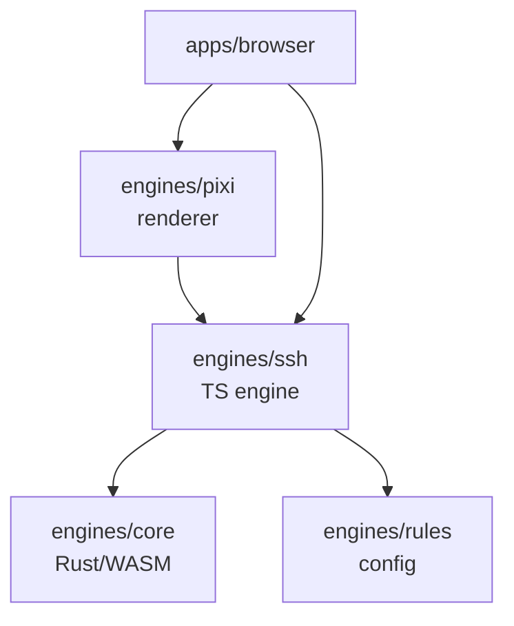

# Rust/WASM Core Engine — Architecture & Game Generation

## Motivation

Anarkai needs to generate terrain and game board data at scale. The current [`engines/ssh`](../engines/ssh/) package uses TypeScript for population placement, settlement scoring, and board generation (deposits + goods). These computations are deterministic but performance-critical, and Rust provides:

1. **Performance ceiling** — TypeScript cannot compete with Rust for the compute-intensive algorithms needed for large-scale board generation.
2. **Determinism across platforms** — Rust's strict floating-point semantics guarantee identical results across platforms (V8 vs SpiderMonkey vs JavaScriptCore).
3. **SSH migration path** — Creating a unified `engines/core` Rust project gives us a clean path to migrate all heavy simulation later.

---

## Project Structure

### Naming: `engines/core`

The name **`engines/core`** was chosen over alternatives:

| Name | Verdict |
|------|---------|
| `engines/ssh-wasm` | Too narrow — suggests only SSH will use it |
| `engines/native` | Suggests desktop/native targets rather than WASM |
| **`engines/core`** | **Chosen** — future-proof, can contain terrain, gameplay, and shared utilities |

### Directory Layout

```
engines/
├── core/                          # Rust/WASM project
│   ├── Cargo.toml
│   ├── build.rs
│   ├── README.md
│   ├── src/
│   │   ├── lib.rs                 # WASM entry point, public exports
│   │   ├── generation/            # Game generation modules (Phase 1-3 complete)
│   │   │   ├── mod.rs             # Coord hash, random utils, re-exports
│   │   │   ├── population.rs      # Character placement
│   │   │   ├── settlements.rs     # Settlement scoring & placement
│   │   │   └── board.rs           # Deposit & goods generation
│   │   ├── terrain/               # Terrain generation module
│   │   │   ├── mod.rs
│   │   │   ├── continental.rs     # Plate tectonics
│   │   │   ├── mountains.rs       # Fault line simulation + ridge noise
│   │   │   ├── erosion.rs         # Particle-based hydraulic erosion
│   │   │   ├── drainage.rs        # D8 flow direction + accumulation
│   │   │   ├── lakes.rs           # Depression filling for natural lakes
│   │   │   ├── affordances.rs     # Buildability, roadability, settlement scores
│   │   │   └── types.rs           # Terrain-specific types
│   │   ├── noise.rs               # Perlin / domain warp / FBM
│   │   └── common/                # Shared utilities
│   │       ├── mod.rs
│   │       ├── hex.rs             # Hex coordinate system
│   │       ├── rng.rs             # Seeded PRNG (deterministic)
│   │       └── bounds.rs          # Region bounds
│   └── pkg/                       # Generated WASM package (git-ignored)
│       ├── anarkai_core.js
│       ├── anarkai_core.d.ts
│       └── anarkai_core_bg.wasm
├── ssh/                           # TypeScript SSH engine
│   ├── src/
│   │   ├── lib/
│   │   │   ├── generation/
│   │   │   │   ├── index.ts       # GameGenerator (WASM adapter for board generation)
│   │   │   │   ├── board.ts       # BoardGenerator (TypeScript fallback + hydrology)
│   │   │   │   ├── population.ts  # PopulationGenerator (TypeScript, WASM-ready)
│   │   │   │   └── settlements.ts # Settlement zoning (TypeScript, WASM-ready)
│   │   │   └── game/
│   │   │       └── game.ts        # Game class (orchestrates all generation)
│   │   └── ...
│   └── package.json
├── pixi/                          # TypeScript renderer
└── rules/                         # Game rules (config only)
```

### Dependency Flow



**Key rule:** `engines/ssh` delegates heavy computation to `engines/core` via WASM, with TypeScript fallbacks for environments where WASM is unavailable.

---

## Generation Modules Overview

All three generation modules are in [`engines/core/src/generation/`](../engines/core/src/generation/) and are designed as **pure Rust** — no WASM dependencies at the module level. WASM bindings are added only in [`lib.rs`](../engines/core/src/lib.rs).

### 1. Population Generation [`population.rs`](../engines/core/src/generation/population.rs)

**Purpose:** Places characters on the game board during initialization based on terrain and distance from origin.

**Key function:**

```rust
// engines/core/src/generation/population.rs:31
pub fn generate_character_positions(
    seed: u32,
    character_count: u32,
    coords: &[HexCoord],
    terrain_kinds: &[u8],
    min_radius: i32,
    max_radius: i32,
    origin: HexCoord,
) -> Vec<HexCoord>
```

**Algorithm:**
1. Filters out water tiles (`terrain_kind == 0`)
2. Filters tiles outside the specified radius range from origin
3. Sorts eligible tiles by distance to origin (ascending)
4. Selects up to `character_count` tiles for character placement

**Data structures used:** [`HexCoord`](../engines/core/src/common/hex.rs) (q, r axial coordinates)

**Note:** The `seed` parameter is currently unused (reserved for future randomization). The algorithm is purely distance-based.

---

### 2. Settlement Generation [`settlements.rs`](../engines/core/src/generation/settlements.rs)

**Purpose:** Scores all valid tiles for settlement placement, selects the best candidates respecting minimum spacing constraints, and assigns settlement kinds (Village, Town, City).

**Key functions:**

```rust
// engines/core/src/generation/settlements.rs:72
pub fn score_settlement_tile(
    seed: u32,
    coord: &HexCoord,
    terrain_kind: u8,
    has_water_access: bool,
    has_river: bool,
    existing_settlements: &[HexCoord],
    min_spacing: i32,
) -> f64

// engines/core/src/generation/settlements.rs:162
pub fn place_settlements(
    seed: u32,
    settlement_count: u32,
    coords: &[HexCoord],
    terrain_kinds: &[u8],
    has_water_access: &[bool],
    has_river: &[bool],
    min_spacing: i32,
) -> Vec<SettlementPlacement>
```

**Scoring factors:**
- **Terrain:** Plains (+10), Forest (+5), Hills (-5), Mountains (-10)
- **Water access:** +20 points
- **River presence:** +15 points
- **Distance penalty:** -1 point per tile closer than `min_spacing` to existing settlement
- **Random jitter:** Small random value (0-0.75) for tie-breaking, based on FNV hash
- **Invalid terrains:** Water and Snow get negative infinity score

**Settlement kinds:**
- **City:** First settlement with score ≥ 7.0 (radius 4)
- **Town:** Any settlement with score ≥ 6.0 (radius 3)
- **Village:** All other settlements (radius 2)

**Data structures:**

```rust
pub enum SettlementKind { Village, Town, City }

pub struct SettlementPlacement {
    pub coord: HexCoord,
    pub score: f64,
    pub kind: SettlementKind,
}
```

**Determinism:** Uses FNV-1a hash of (seed, coordinate, salt) for reproducible random jitter.

---

### 3. Board Generation [`board.rs`](../engines/core/src/generation/board.rs)

**Purpose:** Generates deposits (mineral resources) and ambient goods (harvestable resources) for each tile on the game board.

**Key functions:**

```rust
// engines/core/src/generation/board.rs:67
pub fn generate_deposit(seed: u32, coord: &HexCoord, terrain_kind: u8) -> Option<DepositKind>

// engines/core/src/generation/board.rs:137
pub fn generate_goods(
    seed: u32, coord: &HexCoord, terrain_kind: u8, deposit_kind: Option<DepositKind>
) -> Vec<GoodKind>

// engines/core/src/generation/board.rs:229
pub fn generate_board(
    seed: u32, coords: &[HexCoord], terrain_kinds: &[u8]
) -> Vec<TileGenerationResult>
```

**Deposit probabilities by terrain:**

| Terrain | Stone | Iron | Gold | None |
|---------|-------|------|------|------|
| Mountains | 30% | 15% | 5% | 50% |
| Hills | 40% | 10% | 0% | 50% |
| Forest | 25% (as Stone) | 0% | 0% | 75% |
| Plains | 0% | 0% | 0% | 100% |
| Water | 0% | 0% | 0% | 100% |
| Snow | 0% | 0% | 0% | 100% |
| Concrete | 0% | 0% | 0% | 100% |

**Ambient goods by terrain:**

| Terrain | Goods (probability) |
|---------|---------------------|
| Forest | Berries (40%), Mushrooms (30%) |
| Plains | Berries (50%), Mushrooms (40%) |
| Hills | Stone ambient (30% if no deposit) |
| Mountains | Stone ambient (20%), Iron ambient (10%), Gold ambient (5%) |
| Water | Fish (70%) |
| Snow/Concrete | None |

**Data structures:**

```rust
pub enum DepositKind { Stone, Iron, Gold }
pub enum GoodKind { Wood, Stone, Iron, Gold, Berries, Mushrooms, Fish }

pub struct TileGenerationResult {
    pub coord: HexCoord,
    pub deposit_kind: Option<DepositKind>,
    pub goods: Vec<GoodKind>,
}
```

**Determinism:** Uses FNV-1a hash of (seed, coordinate, salt) with separate salts for deposit ("deposit"), goods ("goods", "goods2", "goods3") to generate independent random values for each resource type.

---

### Shared Utilities

**Coord hash** ([`mod.rs:16`](../engines/core/src/generation/mod.rs:16)):

```rust
pub fn coord_hash(seed: u32, coord: &HexCoord, salt: &str) -> u64
```

FNV-1a based hash combining seed, coordinate (q, r), and a salt string. Matches TypeScript's `hashString` implementation for cross-platform determinism.

**Random [0,1)** ([`mod.rs:57`](../engines/core/src/generation/mod.rs:57)):

```rust
pub fn random01(hash: u64) -> f64
```

Converts lower 32 bits of hash to float in range [0, 1) by dividing by `u32::MAX` (4294967295).

---

## WASM Bindings

All WASM bindings are in [`engines/core/src/lib.rs`](../engines/core/src/lib.rs). The generation modules themselves are WASM-free; bindings handle type conversion between Rust and JavaScript.

### Exported WASM Functions

#### Population

```rust
#[wasm_bindgen]
pub fn wasm_generate_character_positions(
    seed: u32,
    character_count: u32,
    coords: &[i32],           // packed: [q, r, q, r, ...]
    terrain_kinds: &[u8],     // 0=water, 1=plains, 2=forest, ...
    radius_range: &[i32],     // [min_radius, max_radius]
    origin: &[i32],           // [origin_q, origin_r]
) -> Vec<i32>                 // packed: [q, r, q, r, ...]
```

#### Settlements

```rust
#[wasm_bindgen]
pub fn wasm_place_settlements(
    seed: u32,
    settlement_count: u32,
    coords: &[i32],           // packed: [q, r, q, r, ...]
    terrain_kinds: &[u8],
    has_water_access: &[u8],  // 0=false, non-zero=true
    has_river: &[u8],
    min_spacing: i32,
) -> Vec<i32>                 // packed: [q, r, kind_code, score*100, ...]
                              // kind_code: 0=Village, 1=Town, 2=City
```

#### Board (Deposits + Goods)

```rust
#[wasm_bindgen]
pub fn wasm_generate_board(
    seed: u32,
    coords: &[i32],           // packed: [q, r, q, r, ...]
    terrain_kinds: &[u8],
) -> Vec<u8>                  // packed binary format (see below)
```

**Board result binary format per tile:**
```
Bytes 0-3:   coord.q (i32, little-endian)
Bytes 4-7:   coord.r (i32, little-endian)
Byte  8:     deposit_kind (0=none, 1=stone, 2=iron, 3=gold)
Byte  9:     goods_count
Bytes 10+:   goods (1 byte each: 0=wood, 1=stone, 2=iron, 3=gold, 4=berries, 5=mushrooms, 6=fish)
```

### WASM Type Mapping (Terrain Kinds)

| WASM index | Rust constant | Game TerrainType | Notes |
|-----------|---------------|------------------|-------|
| 0 | `TERRAIN_WATER` | `water` | Excluded from population/settlement |
| 1 | `TERRAIN_PLAINS` | `grass`, `sand` | Sand maps to plains in WASM |
| 2 | `TERRAIN_FOREST` | `forest` | |
| 3 | `TERRAIN_HILLS` | `rocky` | Rocky terrain maps to hills |
| 4 | `TERRAIN_MOUNTAINS` | _(not used by game)_ | Only in deposits/goods |
| 5 | `TERRAIN_SNOW` | `snow` | Excluded from settlement scoring |
| 6 | `TERRAIN_CONCRETE` | `concrete` | Neutral for scoring |

---

## TypeScript Adapters

### GameGenerator ([`engines/ssh/src/lib/generation/index.ts`](../engines/ssh/src/lib/generation/index.ts))

The `GameGenerator` class is the primary TypeScript adapter bridging WASM and the game engine.

#### Methods

```typescript
class GameGenerator {
    // Synchronous generation using TypeScript BoardGenerator (no WASM)
    generateRegion(config, coords, terraforming?): GeneratedTileData[]

    // Async generation using WASM core for deposits/goods type determination
    async generateBoard(seed, snapshot): Promise<GeneratedTileData[]>

    // Full async pipeline: terrain + board generation
    async generateRegionAsync(config, coords, terraforming?): Promise<GeneratedTileData[]>

    // Sector-based generation with hydrology
    async generateSectorsAsync(config, sectors, terraforming?, options?): Promise<GeneratedTileData[]>

    // Macro hydrology overview
    async generateMacroHydrologyAsync(config, centerSector, options?): Promise<TerrainMacroHydrologySnapshot>
}
```

#### WASM-to-TypeScript Type Mapping

**Terrain mapping** ([`index.ts:97-108`](../engines/ssh/src/lib/generation/index.ts:97)):
```typescript
function toWasmTerrainKind(terrain: TerrainType): number {
    // water→0, forest→2, rocky→3(hills), grass→1(plains), sand→1, snow→5, concrete→6
}
```

**Deposit mapping** ([`index.ts:119-124`](../engines/ssh/src/lib/generation/index.ts:119)):
```typescript
const WASM_DEPOSIT_TO_GAME = {
    0: null,      // none
    1: 'rock',    // stone
    2: 'rock',    // iron → all minerals map to 'rock'
    3: 'rock',    // gold
}
```

**Goods mapping** ([`index.ts:136-144`](../engines/ssh/src/lib/generation/index.ts:136)):
```typescript
const WASM_GOOD_TO_GAME = {
    0: 'wood',        // wood
    1: 'stone',       // stone
    2: null,          // iron — no game equivalent
    3: null,          // gold — no game equivalent
    4: 'berries',     // berries
    5: 'mushrooms',   // mushrooms
    6: null,          // fish — no game equivalent
}
```

#### Amount Computation

While WASM determines **which** deposits and goods exist on a tile, TypeScript computes **how much** (amounts) using engine-rules configuration ([`index.ts:202-301`](../engines/ssh/src/lib/generation/index.ts:202)). This separation keeps game balance configuration in TypeScript/engine-rules while compute-intensive type determination runs in Rust.

#### BoardGenerator (TypeScript fallback)

[`engines/ssh/src/lib/generation/board.ts`](../engines/ssh/src/lib/generation/board.ts) contains the `BoardGenerator` class — the synchronous TypeScript fallback that generates deposits and goods using the same PRNG approach but with game-specific type resolution. It also handles hydrology data projection (river edges, channels, banks) from terrain snapshots.

---

## Integration: How WASM Is Called

The primary integration path is in [`GameGenerator.generateBoard()`](../engines/ssh/src/lib/generation/index.ts:371):

1. Resolve tile entries from terrain snapshot (terrain type, biome, coordinate)
2. Build flat `Int32Array` of coordinates and `Uint8Array` of terrain kinds
3. Call `wasm_generate_board(seed, coords, terrainKinds)` via dynamic import
4. Parse the packed `Uint8Array` result into deposit/goods types
5. Compute amounts in TypeScript using engine-rules configuration
6. Build final `GeneratedTileData[]` with coordinate, terrain, height, hydrology, deposit, goods

Flow:
```
TerrainSnapshot → resolveTileEntries() → [coords[], terrainKinds[]]
    → wasm_generate_board() → packed Uint8Array
    → parseWasmBoardResult() → Map<key, {deposit, goods[]}>
    → computeGoodsAmounts() / computeDepositAmount() → GeneratedTileData[]
```

---

## Migration Summary

### What Was Migrated (Phase 1-3)

All three generation phases are now implemented in Rust with WASM bindings:

| Phase | Module | Rust file | WASM export | TypeScript status |
|-------|--------|-----------|-------------|-------------------|
| Phase 1 | Population | [`population.rs`](../engines/core/src/generation/population.rs) | `wasm_generate_character_positions` | TS fallback kept, WASM available |
| Phase 2 | Settlements | [`settlements.rs`](../engines/core/src/generation/settlements.rs) | `wasm_place_settlements` | TS fallback kept, WASM available |
| Phase 3 | Board | [`board.rs`](../engines/core/src/generation/board.rs) | `wasm_generate_board` | **Primary path** uses WASM; TS BoardGenerator is fallback |

### What Was Deleted

All old TypeScript generation logic that has been superseded by Rust:

- **Phase 1:** Old TypeScript population generation code deleted (specific file removed)
- **Phase 2:** Old TypeScript settlement scoring/placement code deleted (specific file removed)
- **Phase 3:** Old TypeScript deposit/goods generation in `BoardGenerator` remains as fallback, but primary path now delegates to WASM

### Current Integration Status

- **Board generation (deposits + goods):** Fully integrated — [`GameGenerator.generateBoard()`](../engines/ssh/src/lib/generation/index.ts:371) calls `wasm_generate_board()` via WASM
- **Population generation:** WASM function available but not yet called from TypeScript; TypeScript fallback still used
- **Settlement placement:** WASM function available but not yet called from TypeScript; TypeScript fallback still used

### Remaining TypeScript Fallbacks

The TypeScript `BoardGenerator` class in [`board.ts`](../engines/ssh/src/lib/generation/board.ts) remains for:
1. Synchronous generation path (`generateRegion()`)
2. Environments where WASM is unavailable
3. Hydrology data projection (river edges, channels, banks) which is not yet in Rust

---

## Terrain Generation: Algorithm Overview

### Current System (in `engines/core/src/terrain/`)

The terrain generation system in Rust provides:

- **Perlin noise FBM** for height, temperature, humidity, and terrain type
- **Priority-flood hydrology** for river networks with Strahler stream ordering
- **Biome classification** (Ocean, Lake, RiverBank, Wetland, Sand, Grass, Forest, Rocky, Snow)
- **Affordance computation** (buildability, roadability, settlement suitability, production suitability)
- **Plate tectonics** (continental generation, mountain ranges)
- **Hydraulic erosion** (particle-based)

### Performance Estimates

These are estimates for a 1000×1000 tile region (1M tiles). Actual numbers will vary with platform and optimization level.

| Operation | TypeScript (est.) | Rust/WASM (est.) | Speedup |
|-----------|-------------------|-------------------|---------|
| Continental generation | ~5000 ms | ~200 ms | ~25× |
| Mountain generation | ~2000 ms | ~100 ms | ~20× |
| Hydraulic erosion (100k droplets) | ~10000 ms | ~400 ms | ~25× |
| D8 flow direction | ~2000 ms | ~80 ms | ~25× |
| Flow accumulation | ~3000 ms | ~120 ms | ~25× |
| Lake detection + filling | ~2000 ms | ~100 ms | ~20× |
| Affordance computation | ~1000 ms | ~50 ms | ~20× |
| Board generation (deposits+goods) | ~500 ms | ~30 ms | ~17× |
| **Full pipeline** | **~25 s** | **~1 s** | **~25×** |

---

## Testing Strategy

### Rust Unit Tests

All three generation modules have comprehensive unit tests in the same file under `#[cfg(test)]`:

- **Population** ([`population.rs:80-459`](../engines/core/src/generation/population.rs:80)): 10 tests covering empty inputs, water exclusion, radius filtering, determinism
- **Settlements** ([`settlements.rs:242-549`](../engines/core/src/generation/settlements.rs:242)): 14 tests covering terrain scoring, bonuses, penalties, spacing, determinism
- **Board** ([`board.rs:256-649`](../engines/core/src/generation/board.rs:256)): 18 tests covering deposit probabilities, goods generation, determinism, edge cases

Run with:
```bash
cd engines/core && cargo test
```

### TypeScript Integration Tests

Tests for the TypeScript adapters are in:
- [`engines/ssh/src/lib/generation/board.spec.ts`](../engines/ssh/src/lib/generation/board.spec.ts)
- [`engines/ssh/src/lib/generation/population.spec.ts`](../engines/ssh/src/lib/generation/population.spec.ts)
- [`engines/ssh/src/lib/generation/settlements.spec.ts`](../engines/ssh/src/lib/generation/settlements.spec.ts)

---

## Configuration & Tuning

### Terrain Configuration

All algorithm parameters live in `TerrainConfig`, defined in Rust and mirrored in TypeScript:

```rust
// engines/core/src/terrain/types.rs
pub struct TerrainConfig {
    pub scale: f32,
    pub terrain_type_scale: f32,
    pub octaves: u32,
    pub persistence: f32,
    pub lacunarity: f32,
    pub sea_level: f32,
    pub snow_level: f32,
    pub rocky_level: f32,
    pub forest_level: f32,
    pub sand_temperature: f32,
    pub sand_humidity: f32,
    pub wetland_humidity: f32,
    pub forest_humidity: f32,
    // ... hydrology config
}
```

### Game Generation Configuration

Deposit probabilities and goods generation rules are hardcoded in [`board.rs`](../engines/core/src/generation/board.rs) to match the game design. The TypeScript layer in [`index.ts`](../engines/ssh/src/lib/generation/index.ts) handles amount computation using [`engine-rules`](../engines/rules/) configuration.

---

## Design Decisions

### Why Rust/WASM and Not Just Optimized TypeScript?

1. **Compute intensity:** Board generation on large maps benefits from Rust's zero-cost abstractions
2. **SSH migration path:** The gameplay engine (`engines/ssh`) will move to Rust. Starting with generation builds the project structure, build pipeline, and TypeScript integration patterns
3. **Determinism:** Rust's strict floating-point semantics guarantee identical results across platforms
4. **Memory efficiency:** Rust's `Vec<f32>` has zero overhead vs raw bytes

### Why Pure Rust Modules + WASM Bindings in lib.rs?

The generation modules (`population.rs`, `settlements.rs`, `board.rs`) contain **no WASM dependencies**. WASM bindings are only added in `lib.rs`. This design:
- Allows the modules to be compiled and tested server-side (native target) without WASM
- Makes future server-side extraction straightforward
- Keeps core logic clean and framework-agnostic
- Enables `cargo check --target x86_64-unknown-linux-gnu` to verify pure Rust compilation

### Why FNV-1a for Deterministic Hashing?

FNV-1a is used instead of a cryptographic hash because:
- It's fast (single multiply-XOR per byte)
- It's simple to reimplement identically in TypeScript and Rust
- It provides sufficient distribution for game randomization
- It matches the TypeScript `hashString` implementation

---

## Related Documents

- [`architecture-overview.md`](./architecture-overview.md) — System boundaries and data flow
- [`world-representation.md`](./world-representation.md) — Physical scale and hex tile model
- [`terrain-generation-roadmap.md`](./terrain-generation-roadmap.md) — NPC placement, affordances, road generation
- [`next-directions.md`](./next-directions.md) — Priority of terrain rework vs other features
- [`current-status.md`](./current-status.md) — Current development status
- [`plans/rust-generation-porting-spec.md`](../plans/rust-generation-porting-spec.md) — Original porting specification
- [`engines/core/src/generation/mod.rs`](../engines/core/src/generation/mod.rs) — Module declarations and shared utilities
- [`engines/core/src/lib.rs`](../engines/core/src/lib.rs) — WASM bindings and public exports
- [`engines/ssh/src/lib/generation/index.ts`](../engines/ssh/src/lib/generation/index.ts) — TypeScript GameGenerator adapter
