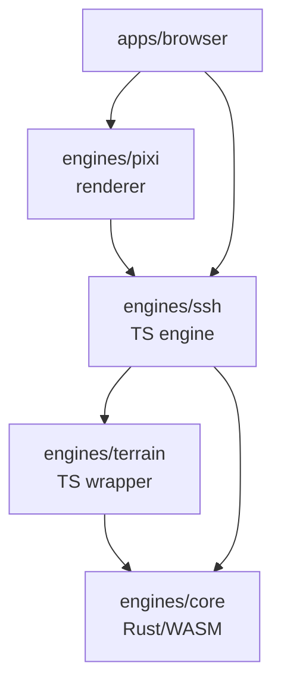

# Rust/WASM Core Engine — Architecture & Terrain Generation Refactoring

## Motivation

Anarkai needs to generate terrain at scale. The current [`engines/terrain`](../engines/terrain/) package
uses TypeScript with Perlin noise (FBM) and probabilistic hydrology. This is deterministic and streamable,
but it has two structural problems:

1. **No continental geography** — Perlin alone produces smooth, continuous terrain without distinct
   continents, oceans, mountain ranges, or natural lakes.
2. **Performance ceiling** — TypeScript cannot compete with Rust for the compute-intensive algorithms
   needed for realistic terrain (plate tectonics, drainage basin analysis, hydraulic erosion).

More importantly, [`engines/ssh`](../engines/ssh/) — the gameplay engine — will eventually migrate to
Rust/WASM. Creating a unified `engines/core` Rust project now, starting with terrain, gives us a
clean path to migrate all heavy simulation later.

---

## Project Structure

### Naming: `engines/core`

The name **`engines/core`** was chosen over alternatives:

| Name | Verdict |
|------|---------|
| `engines/ssh-wasm` | Too narrow — suggests only SSH will use it |
| `engines/native` | Suggests desktop/native targets rather than WASM |
| **`engines/core`** | **Chosen** — future-proof, can contain terrain, gameplay, and shared utilities |

### Directory Layout

```
engines/
├── core/                          # Rust/WASM project
│   ├── Cargo.toml
│   ├── build.rs
│   ├── README.md
│   ├── src/
│   │   ├── lib.rs                 # WASM entry point, public exports
│   │   ├── terrain/               # Terrain generation module (Phase 1)
│   │   │   ├── mod.rs
│   │   │   ├── continental.rs     # Plate tectonics
│   │   │   ├── mountains.rs       # Fault line simulation + ridge noise
│   │   │   ├── erosion.rs         # Particle-based hydraulic erosion
│   │   │   ├── drainage.rs        # D8 flow direction + accumulation
│   │   │   ├── lakes.rs           # Depression filling for natural lakes
│   │   │   ├── affordances.rs     # Buildability, roadability, settlement scores
│   │   │   └── types.rs           # Terrain-specific types
│   │   ├── gameplay/              # Future: SSH gameplay logic (Phase 2+)
│   │   │   ├── mod.rs
│   │   │   ├── board.rs
│   │   │   ├── entities.rs
│   │   │   ├── pathfinding.rs
│   │   │   └── simulation.rs
│   │   ├── common/                # Shared utilities
│   │   │   ├── mod.rs
│   │   │   ├── noise.rs           # Perlin / Simplex / value noise
│   │   │   ├── math.rs            # Vector math, interpolation
│   │   │   ├── rng.rs             # Seeded PRNG (deterministic)
│   │   │   ├── hex.rs             # Hex coordinate system
│   │   │   └── wasm.rs            # WASM binding helpers
│   │   └── types/                 # Shared types across all modules
│   │       ├── mod.rs
│   │       ├── coordinates.rs     # Axial/offset/cube hex coordinates
│   │       ├── terrain.rs         # TileField, EdgeField, BiomeHint
│   │       └── serialization.rs   # Serde-based save/load types
│   └── pkg/                       # Generated WASM package (git-ignored)
│       ├── anarkai_core.js
│       ├── anarkai_core.d.ts
│       └── anarkai_core_bg.wasm
├── terrain/                       # TypeScript terrain engine (wrapper)
│   ├── src/
│   │   ├── wasm-adapter.ts        # Bridge to engines/core WASM
│   │   ├── generate.ts            # Entry point: WASM or CPU fallback
│   │   ├── fields/                # Existing field generation (fallback)
│   │   ├── hydrology/             # Existing hydrology (to be replaced)
│   │   └── types.ts               # TypeScript mirror of core types
│   └── package.json
├── ssh/                           # TypeScript SSH engine (to migrate)
│   ├── src/
│   │   ├── wasm-adapter.ts        # Future: bridge to engines/core
│   │   └── ...
│   └── package.json
├── pixi/                          # TypeScript renderer
└── rules/                         # Game rules (config only)
```

### Dependency Flow



**Key rule:** `engines/terrain` and `engines/ssh` are TypeScript wrappers. They own the public API
that Pixi and the browser consume. They delegate heavy computation to `engines/core` via WASM,
with CPU fallbacks for environments where WASM is unavailable.

---

## Terrain Generation: Algorithm Overview

### Current System (to be replaced)

The current system in [`engines/terrain/src/fields/cpu.ts`](../engines/terrain/src/fields/cpu.ts) and
[`engines/terrain/src/hydrology/trace.ts`](../engines/terrain/src/hydrology/trace.ts) uses:

- **Perlin noise FBM** for height, temperature, humidity, and terrain type
- **Probabilistic spring placement** with bounded path search for rivers
- **Threshold-based biome classification** (sea level, snow level, rocky level, etc.)

Limitations:

- No continental structure — everything is continuous noise
- No natural lakes — depressions are invisible
- Rivers are probabilistic path traces, not drainage basins
- Mountains are isolated peaks, not ranges
- No concept of watersheds or regions

### Proposed System

The new system uses a **multi-layer deterministic pipeline**, each layer based on a proven algorithm:

```
Seed → [1. Continental Layer] → [2. Mountain Layer] → [3. Erosion Layer] → [4. Drainage Layer] → [5. Affordances]
```

Each layer is independent and can be tuned or replaced without rewriting the others.

---

## Layer 1: Continental Generation

### Algorithm: Voronoi-based Plate Tectonics

**Reference:** Fisher et al., "Procedural Generation of Natural Terrain" (2014)

### Concept

1. Generate `n` Voronoi cells representing tectonic plates.
2. Assign each plate a type: **oceanic** (low elevation baseline) or **continental** (high baseline).
3. Assign each plate a velocity vector.
4. At plate boundaries:
   - **Convergent** (plates moving toward each other) → mountain range uplift
   - **Divergent** (plates moving apart) → rift valley or ocean ridge
   - **Transform** (plates sliding past each other) → fault line, no major elevation change
5. Blend plate boundaries with Perlin noise for natural-looking transitions.

### Output

- **Continental mask:** `bool` per tile (ocean vs land)
- **Base elevation:** `f32` per tile, before mountains and erosion

### Rust Sketch

```rust
// engines/core/src/terrain/continental.rs

pub struct Plate {
    pub id: u32,
    pub plate_type: PlateType,
    pub center: Vec2,
    pub velocity: Vec2,
}

pub enum PlateType {
    Oceanic { base_elevation: f32 },
    Continental { base_elevation: f32 },
}

pub struct ContinentalLayer {
    pub mask: Vec<bool>,        // true = land
    pub base_elevation: Vec<f32>,
}

/// Generate plates and compute continental mask + base elevation.
/// `plate_count` controls world diversity: 5-8 for a continent-focused map,
/// 12-20 for an archipelago or multi-continent world.
pub fn generate_continents(
    seed: u64,
    bounds: Bounds,
    plate_count: usize,
    ocean_ratio: f32,  // 0.0 = all land, 1.0 = all ocean; typical 0.55-0.65
) -> ContinentalLayer;
```

### Why This Algorithm

- **Proven in games and research:** Used by everything from Dwarf Fortress worldgen to academic papers.
- **Creates distinct continents:** Unlike Perlin, which produces one continuous landmass with varying height.
- **Natural mountain placement:** Mountains form at plate boundaries, which is geologically correct.
- **Deterministic:** Same seed + same plate count = same world.
- **Tunable:** Plate count, ocean ratio, and velocity magnitude all act as clear knobs.

---

## Layer 2: Mountain Range Generation

### Algorithm: Fault Line Simulation + Ridge Noise

**Reference:** Smelik et al., "Real-Time Procedural Terrain Generation" (2014)

### Concept

1. Use **plate boundaries** from Layer 1 as mountain seed locations.
2. Along each convergent boundary, simulate **fault line deformation**:
   - The boundary is a line; uplift decays with distance from the line.
   - Uplift height is proportional to convergence speed.
3. Add **ridge noise** (1D Perlin along the boundary, 2D Perlin across) to create
   jagged peaks, passes, and secondary ridges.
4. Blend mountain elevation into the base elevation using a smooth max.

### Output

- **Mountain elevation:** `f32` per tile, added to base elevation

### Rust Sketch

```rust
// engines/core/src/terrain/mountains.rs

pub struct MountainConfig {
    pub max_uplift: f32,
    pub fault_decay_distance: f32,   // how far from boundary uplift affects
    pub ridge_frequency: f32,         // how jagged the peaks are
    pub ridge_amplitude: f32,
}

/// Generate mountain elevation from plate boundaries.
pub fn generate_mountains(
    seed: u64,
    bounds: Bounds,
    plates: &[Plate],
    base_elevation: &[f32],
    config: &MountainConfig,
) -> Vec<f32>;
```

### Why This Algorithm

- Mountains form **ranges**, not isolated peaks — ridges follow fault lines for hundreds of tiles.
- Blend with Perlin gives natural irregularity without losing the range structure.
- Passes form naturally where ridge noise dips, creating obvious travel corridors.

---

## Layer 3: Hydraulic Erosion

### Algorithm: Particle-Based Hydraulic Erosion

**Reference:** Št'ava et al., "Real-Time Erosion Using Shallow Water" (2008)
Adapted from the classic Musgrave et al. erosion model.

### Concept

1. Spawn `n` water droplets at random high-elevation positions.
2. For each droplet, simulate descent:
   - Move downhill following gradient.
   - Pick up sediment proportional to velocity and local slope.
   - Deposit sediment when velocity drops or capacity is exceeded.
   - Evaporate slowly.
3. After all droplets, the terrain has:
   - **Valleys** where water flowed repeatedly.
   - **Deposits** in flat areas where sediment settled.
   - Natural-looking river channels.

### Output

- **Eroded elevation:** `f32` per tile (replaces input elevation)
- **Sediment map:** `f32` per tile (for deposit/fertility hints)

### Rust Sketch

```rust
// engines/core/src/terrain/erosion.rs

pub struct ErosionConfig {
    pub droplet_count: usize,
    pub droplet_lifetime: u32,      // steps before evaporation
    pub inertia: f32,                // momentum carry-over
    pub capacity_factor: f32,        // how much sediment a droplet can carry
    pub deposit_factor: f32,         // how quickly sediment is dropped
    pub erosion_factor: f32,         // how quickly terrain is picked up
    pub evaporation_rate: f32,
    pub min_slope: f32,              // stop if slope is too flat
}

/// Run particle-based erosion on the elevation field.
pub fn simulate_erosion(
    seed: u64,
    elevation: &mut [f32],
    bounds: Bounds,
    config: &ErosionConfig,
) -> Vec<f32>;  // sediment map
```

### Why This Algorithm

- Creates **realistic valleys** that follow flow paths — these become natural road and river corridors.
- Sediment deposits create **fertile lowlands** for settlements and farms.
- Deterministic with fixed seed and droplet count.
- GPU-friendly if we later want to accelerate with WebGPU compute shaders.

---

## Layer 4: Drainage Basins & Rivers

### Algorithm: D8 Flow Direction + Flow Accumulation + Strahler Ordering

**References:**
- Jenson & Domingue, "Extracting Topographic Structure from Digital Elevation Data" (1988)
- Strahler, "Quantitative Analysis of Watershed Geomorphology" (1957)
- Freeman, "A Fast Algorithm for the Calculation of Flow Accumulation" (1991)

### Concept

This **replaces** the current spring-based probabilistic river system entirely.

1. **D8 Flow Direction:** For each land tile, find the neighbor with the steepest descent. The tile
   "flows" to that neighbor. Flat tiles and depressions are resolved with priority-first search.
2. **Flow Accumulation:** Count how many tiles flow into each tile (the upstream contributing area).
3. **Stream Definition:** Tiles with flow accumulation above a threshold become stream tiles.
   Higher thresholds → fewer, larger rivers. Lower thresholds → more tributaries.
4. **Strahler Stream Order:** Assign a hierarchical order to each stream segment:
   - 1st order: headwater streams (no tributaries)
   - 2nd order: where two 1st-order streams meet
   - 3rd order: where two 2nd-order streams meet, etc.
5. **Lake Detection:** Find depressions (tiles with no outflow). Fill them. The filled volume
   becomes a lake. Outlet is the lowest point on the lake rim.

### Output

- **Flow direction:** `u8` per tile (0-7, or 255 for ocean/sink)
- **Flow accumulation:** `f32` per tile (upstream area)
- **River graph:** `Vec<RiverSegment>` with stream order, flux, and channel tiles
- **Lakes:** `Vec<Lake>` with outlet, volume, and surface tiles
- **Drainage basins:** `Vec<DrainageBasin>` with outlet and contributing tiles

### Rust Sketch

```rust
// engines/core/src/terrain/drainage.rs

pub struct DrainageConfig {
    pub stream_threshold: f32,       // min flow accumulation for a stream
    pub major_river_threshold: f32,  // threshold for "major" classification
}

pub struct RiverSegment {
    pub stream_order: u8,
    pub flux: f32,
    pub channel_tiles: Vec<AxialCoord>,
    pub children: Vec<usize>,  // indices of tributary segments
}

pub struct DrainageBasin {
    pub outlet: AxialCoord,    // where water leaves this basin (coast or basin edge)
    pub area: f32,             // number of tiles
    pub main_river: usize,     // index into RiverSegment list
}

/// Compute flow direction (D8), flow accumulation, and extract river network.
pub fn compute_drainage(
    elevation: &[f32],
    land_mask: &[bool],
    bounds: Bounds,
    config: &DrainageConfig,
) -> DrainageResult {
    let flow_dir = compute_flow_direction_d8(elevation, land_mask, bounds);
    let accumulation = compute_flow_accumulation(&flow_dir, bounds);
    let rivers = extract_river_network(&flow_dir, &accumulation, config);
    let (lakes, filled_elevation) = detect_and_fill_lakes(elevation, land_mask, bounds);
    let basins = partition_drainage_basins(&flow_dir, &accumulation, land_mask, bounds);
    DrainageResult { flow_dir, accumulation, rivers, lakes, basins, filled_elevation }
}
```

### Lake Detection Detail

```rust
// engines/core/src/terrain/lakes.rs

pub struct Lake {
    pub surface_tiles: Vec<AxialCoord>,
    pub outlet: AxialCoord,
    pub water_level: f32,
    pub volume: f32,
    pub depth_map: Vec<f32>,    // per-tile depth
}

/// Find all depressions, fill them, and return lake definitions.
/// Uses Planchon-Darboux depression filling algorithm.
pub fn detect_and_fill_lakes(
    elevation: &[f32],
    land_mask: &[bool],
    bounds: Bounds,
) -> (Vec<Lake>, Vec<f32>);  // lakes + filled elevation
```

### Why These Algorithms

- **D8 flow direction:** The standard in hydrology for 30 years. Simple, deterministic, well-understood.
- **Flow accumulation:** Directly answers "how much water flows through this tile?" — essential for
  river width, bridge placement, and settlement water access scoring.
- **Strahler ordering:** Gives a clear hierarchy: 1st-order = small stream, 4th+ = major river.
  NPC placement can use this to prefer settlements on mid-order rivers.
- **Depression filling:** Creates natural lakes wherever the terrain has basins. No need to
  manually place lakes or rely on probabilistic spring accidents.
- **Drainage basins:** Natural regions for NPC settlement — each basin is a self-contained
  watershed with one outlet to the sea or another basin.

---

## Layer 5: Terrain Affordances

This layer mirrors the `TerrainAffordance` concept from
[`docs/terrain-generation-roadmap.md`](./terrain-generation-roadmap.md), computed in Rust for
performance and shipped to TypeScript for NPC generation.

### Affordance Fields

```rust
// engines/core/src/terrain/affordances.rs

pub struct TerrainAffordance {
    pub buildability: f32,           // 0 = unbuildable, 1 = ideal
    pub roadability: f32,            // how cheap to build/maintain roads
    pub settlement_suitability: f32, // composite score for NPC inhabitation
    pub production_suitability: f32, // composite score for production hives
    pub water_access: f32,           // proximity to river/lake/coast
    pub slope_penalty: f32,          // higher = worse for roads/buildings
    pub resource_potential: ResourcePotential,
}

pub struct ResourcePotential {
    pub timber: f32,
    pub stone: f32,
    pub fertile: f32,   // farmland suitability
    pub ore: f32,       // mining suitability
    pub fish: f32,      // fishing suitability (near water)
}
```

### Computation

Each affordance is a weighted combination of:
- Elevation, slope, and local roughness
- Biome type (forest, grass, rocky, sand, snow, wetland)
- Distance to water (river, lake, coast)
- Flow accumulation (for water access)
- Latitude-equivalent temperature zone

All weights are configurable in the Rust `TerrainConfig` and exposed to TypeScript for tuning.

---

## WASM Interface

### Public API (`engines/core/src/lib.rs`)

```rust
use wasm_bindgen::prelude::*;

#[wasm_bindgen]
pub struct CoreEngine {
    seed: u64,
    config: TerrainConfig,
}

#[wasm_bindgen]
impl CoreEngine {
    #[wasm_bindgen(constructor)]
    pub fn new(seed: u64) -> Self;

    /// Generate continental layer (mask + base elevation) for a region.
    pub fn generate_continents(&self, bounds: JsBounds) -> JsContinentalLayer;

    /// Compute mountains from plate boundaries.
    pub fn generate_mountains(
        &self,
        bounds: JsBounds,
        plates: JsPlates,
        base_elevation: Vec<f32>,
    ) -> Vec<f32>;

    /// Run hydraulic erosion on the elevation field.
    pub fn simulate_erosion(
        &self,
        elevation: &mut [f32],
        bounds: JsBounds,
    ) -> Vec<f32>; // sediment map

    /// Full drainage analysis: flow direction, accumulation, rivers, lakes, basins.
    pub fn compute_drainage(
        &self,
        elevation: Vec<f32>,
        land_mask: Vec<bool>,
        bounds: JsBounds,
    ) -> JsDrainageResult;

    /// Compute terrain affordance fields from all previous layers.
    pub fn compute_affordances(
        &self,
        elevation: Vec<f32>,
        flow_accumulation: Vec<f32>,
        land_mask: Vec<bool>,
        lakes: JsLakes,
        bounds: JsBounds,
    ) -> JsAffordanceMap;

    /// Full terrain generation pipeline for a region: runs all layers.
    /// Returns the complete set of terrain fields ready for SSH consumption.
    pub fn generate_region(
        &self,
        bounds: JsBounds,
    ) -> JsRegionResult;
}
```

### TypeScript Wrapper

```typescript
// engines/terrain/src/wasm-adapter.ts
import init, { CoreEngine, TerrainConfig } from 'anarkai-core';

let corePromise: Promise<CoreEngine> | null = null;

async function getCore(seed: number): Promise<CoreEngine> {
  if (!corePromise) {
    await init();
    corePromise = Promise.resolve(new CoreEngine(seed));
  }
  return corePromise;
}

export async function generateRegionWASM(
  seed: number,
  bounds: Bounds,
  config: TerrainConfig,
): Promise<Map<AxialKey, TileField>> {
  const core = await getCore(seed);
  const result = core.generate_region(bounds);
  return convertToTileFields(result);
}

export function isWasmAvailable(): boolean {
  return typeof WebAssembly !== 'undefined';
}
```

---

## Performance Estimates

These are estimates for a 1000×1000 tile region (1M tiles). Actual numbers will vary with
platform and optimization level.

| Operation | TypeScript (est.) | Rust/WASM (est.) | Speedup |
|-----------|-------------------|-------------------|---------|
| Continental generation | ~5000 ms | ~200 ms | ~25× |
| Mountain generation | ~2000 ms | ~100 ms | ~20× |
| Hydraulic erosion (100k droplets) | ~10000 ms | ~400 ms | ~25× |
| D8 flow direction | ~2000 ms | ~80 ms | ~25× |
| Flow accumulation | ~3000 ms | ~120 ms | ~25× |
| Lake detection + filling | ~2000 ms | ~100 ms | ~20× |
| Affordance computation | ~1000 ms | ~50 ms | ~20× |
| **Full pipeline** | **~25 s** | **~1 s** | **~25×** |

Key factors:
- Rust's zero-cost abstractions and stack allocation avoid GC pressure.
- WASM SIMD (when available) accelerates vector math in erosion and flow algorithms.
- Deterministic PRNG in Rust (`rand_chacha`) is faster than JS `Math.random`-based approaches.

---

## Integration with Existing Code

### What Changes in `engines/terrain`

1. **`src/wasm-adapter.ts`** — New file, bridges to `engines/core`.
2. **`src/generate.ts`** — Modified to try WASM first, fall back to CPU.
3. **`src/fields/cpu.ts`** — Kept as TypeScript fallback.
4. **`src/hydrology/trace.ts`** — Kept as TypeScript fallback, eventually deprecated.
5. **`src/types.ts`** — Extended with new affordance types.

### What Stays the Same

- **`TileField`** and **`TerrainSnapshot`** types — generated fields are backward-compatible.
- **Streaming** — `generateRegion` works on bounded regions; same snapshot merge/prune logic.
- **Biome classification** — thresholds still apply to generated fields.
- **Pixi rendering** — consumes the same `TileField` data, no changes needed.

### What Becomes Legacy (eventually deprecated)

- Spring-based hydrology (`hydrology/trace.ts`, `hydrology/springs.ts`)
- CPU field generation as the primary path (`fields/cpu.ts`)
- `PerlinNoise` class in TypeScript (still used as fallback)

---

## Migration Plan

### Phase 1: Foundation (Weeks 1-2)

1. Create `engines/core` Rust project with `wasm-pack`.
2. Set up CI/CD for Rust → WASM compilation.
3. Implement `common/` module: noise, RNG, hex coordinates, WASM helpers.
4. Publish first WASM package to `engines/core/pkg/`.
5. Create `engines/terrain/src/wasm-adapter.ts` with `isWasmAvailable()` check.
6. Verify: tests pass with WASM fallback (no behavior change yet).

### Phase 2: Continental + Mountains (Weeks 3-5)

1. Implement `terrain/continental.rs` — plate generation + continental mask.
2. Implement `terrain/mountains.rs` — fault line simulation.
3. Expose via WASM, create TypeScript integration path.
4. Keep existing Perlin generation as fallback.
5. Add debug render views for continental mask and mountain ranges.
6. Tune parameters (plate count, ocean ratio) on test seeds.

### Phase 3: Drainage & Rivers (Weeks 6-9)

1. Implement `terrain/drainage.rs` — D8 flow direction + accumulation.
2. Implement `terrain/lakes.rs` — depression filling.
3. Replace spring-based hydrology in `engines/terrain` with drainage-based rivers.
4. Keep spring-based hydrology as disabled legacy code.
5. Add river graph export: segments, stream orders, basin partitions.
6. Update biome classification to use drainage results (river-bank, lake, wetland).

### Phase 4: Erosion & Affordances (Weeks 10-12)

1. Implement `terrain/erosion.rs` — particle-based hydraulic erosion.
2. Implement `terrain/affordances.rs` — buildability, roadability, settlement scores.
3. Integrate with NPC placement pipeline (Phase 1 of terrain-generation-roadmap).
4. Add debug views for affordance fields.
5. Performance profiling and tuning.

### Phase 5: Polish & Documentation (Weeks 13-14)

1. Full test suite for all Rust modules.
2. TypeScript wrapper tests with WASM and CPU fallback paths.
3. Documentation: algorithm references, tuning guide, WASM build instructions.
4. Update `docs/architecture-overview.md` with `engines/core`.
5. Seed comparison tool: same seed, WASM vs CPU, visual diff.

---

## Design Decisions

### Why Rust/WASM and Not Just Optimized TypeScript?

1. **Compute intensity:** Hydraulic erosion on 1M tiles with 100k droplets is ~100M vector operations.
   TypeScript with TypedArrays can reach maybe 2-3M ops/s; Rust/WASM can reach 50M+ ops/s.
2. **SSH migration path:** The gameplay engine (`engines/ssh`) will move to Rust. Starting with
   terrain builds the project structure, build pipeline, and TypeScript integration patterns.
3. **Determinism:** Rust's strict floating-point semantics (when configured correctly) guarantee
   identical results across platforms. JavaScript's `Math` varies slightly between V8, SpiderMonkey,
   and JavaScriptCore.
4. **Memory efficiency:** Rust's `Vec<f32>` has zero overhead vs the raw bytes. TypedArrays are close
   but still incur JS object overhead for each array.

### Why Not WebGPU for Terrain?

WebGPU compute shaders could accelerate erosion and flow accumulation even further. However:

- WebGPU support is still not universal (Safari only recently added it).
- The algorithms need CPU-side logic for graph extraction (rivers, basins, lakes).
- Rust/WASM already provides 20-25× speedup over TypeScript — sufficient for the target scale.
- WebGPU can be added later as an optional acceleration path inside the Rust code (via `wgpu`).

### Why D8 and Not Multiple Flow Direction (MFD)?

D8 routes all flow to one neighbor. MFD splits flow across multiple downhill neighbors.

D8 is chosen because:
- **Deterministic:** One flow direction, easily tested.
- **Sufficient for hex grids:** Hex grids have 6 neighbors; D8 on a square grid has 8.
  Hex actually reduces the single-direction artifact compared to squares.
- **Simpler river extraction:** Single-direction flow creates clear channel lines.
  MFD creates diffuse flow that's harder to convert to a river graph.
- **Standard in games:** Most game terrain systems use single-flow-direction for rivers.

---

## Configuration & Tuning

All algorithm parameters live in `TerrainConfig`, which is defined in Rust and mirrored in TypeScript
for the rules layer.

```rust
// engines/core/src/terrain/types.rs

pub struct TerrainConfig {
    // Continental
    pub plate_count: usize,          // 5-20
    pub ocean_ratio: f32,            // 0.0-1.0, typical 0.6
    pub continental_elevation_base: f32,
    pub oceanic_elevation_base: f32,

    // Mountains
    pub max_uplift: f32,
    pub fault_decay_distance: f32,
    pub ridge_frequency: f32,
    pub ridge_amplitude: f32,

    // Erosion
    pub droplet_count: usize,        // 50k-200k
    pub erosion_strength: f32,

    // Drainage
    pub stream_threshold: f32,
    pub major_river_threshold: f32,
    pub min_lake_area: usize,        // minimum tiles for a lake

    // Affordances
    pub max_slope_for_building: f32,
    pub max_slope_for_road: f32,
    pub water_access_decay: f32,     // distance falloff for water scoring
}
```

Default presets will be provided for:
- **Continental** (one large continent + ocean)
- **Archipelago** (many islands)
- **Pangaea** (single supercontinent)
- **Inland** (no ocean, large lakes instead)

---

## Testing Strategy

### Rust Unit Tests

```rust
// engines/core/src/terrain/drainage.rs
#[cfg(test)]
mod tests {
    #[test]
    fn d8_flow_direction_on_simple_slope() { /* ... */ }
    #[test]
    fn flow_accumulation_counts_correctly() { /* ... */ }
    #[test]
    fn depression_filling_creates_lake() { /* ... */ }
    #[test]
    fn deterministic_with_same_seed() { /* ... */ }
}
```

### TypeScript Integration Tests

```typescript
// engines/terrain/tests/wasm-region.test.ts
describe('WASM terrain generation', () => {
  it('generates a region matching CPU fallback', async () => {
    const wasmTiles = await generateRegionWASM(42, bounds, config);
    const cpuTiles = generateRegionCPU(42, bounds, config);
    // Tiles should be approximately equal (floating point)
    for (const [key, tile] of wasmTiles) {
      expect(tile.height).toBeCloseTo(cpuTiles.get(key)!.height, 4);
    }
  });
});
```

### Visual Diff Tests

Use the existing Pixi terrain renderer to produce snapshots of generated regions and compare
them between seeds, configurations, and WASM vs CPU.

---

## Related Documents

- [`terrain-generation-roadmap.md`](./terrain-generation-roadmap.md) — NPC placement, affordances, road generation
- [`architecture-overview.md`](./architecture-overview.md) — System boundaries and data flow
- [`world-representation.md`](./world-representation.md) — Physical scale and hex tile model
- [`next-directions.md`](./next-directions.md) — Priority of terrain rework vs other features
- [`engines/terrain/docs/algorithm.md`](../engines/terrain/docs/algorithm.md) — Existing terrain algorithm notes
- [`engines/terrain/docs/implementation.md`](../engines/terrain/docs/implementation.md) — Current implementation details
