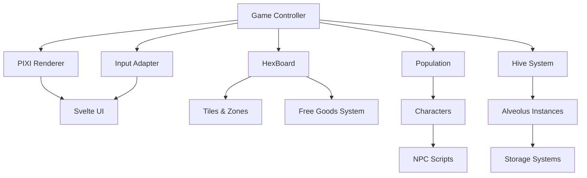
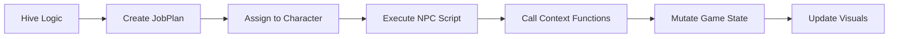
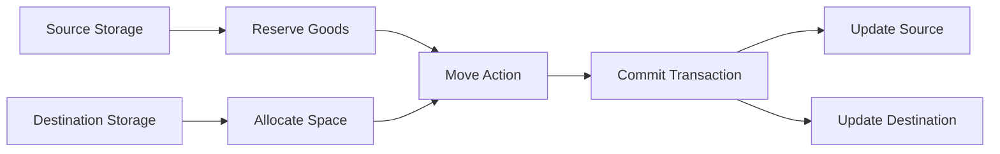

# Architecture Overview

This document describes the high-level architecture of the SSH engine.

## System Architecture



## Core Components

### Game (`game.ts`)

The central controller that orchestrates all game systems.

**Responsibilities:**
- Initialize and manage core systems (Board, Population, Hive)
- Run the simulation loop (ticker)
- Manage game objects and event emissions
- Handle save/load state
- Coordinate rendering and input

**Key Properties:**
- `hex: HexBoard` — The hex grid world
- `population: Population` — Character management
- `ticker: SimulationLoop` — Game loop controller
- `objects: Map<string, InteractiveGameObject>` — All game objects
- `renderer: GameRenderer` — PIXI rendering interface (optional for headless)

**Key Methods:**
- `generate(config, patches)` — Generate world from config and apply patches
- `saveGameData()` — Serialize current state
- `loadGameData(state)` — Restore from saved state
- `registerTickedObject(obj)` — Add object to simulation loop

### HexBoard (`board/board.ts`)

Manages the hexagonal grid world and spatial queries.

**Responsibilities:**
- Store and retrieve tiles by axial coordinates
- Manage zones (harvest, residential, etc.)
- Handle free goods placement and retrieval
- Provide pathfinding utilities

**Key Properties:**
- `boardSize: number` — Radius of the hex world
- `zoneManager: ZoneManager` — Zone assignment system
- `freeGoods: FreeGoodsSystem` — Loose item tracking

**Key Methods:**
- `getTile(coord)` — Retrieve tile at coordinates
- `findPath(from, to, options)` — A* pathfinding
- `getNeighbors(coord)` — Get adjacent tiles

### Tile (`board/tile.ts`)

Represents a single hex tile in the world.

**Responsibilities:**
- Hold tile content (UnBuiltLand, Alveolus, etc.)
- Track terrain and deposits
- Manage visual representation

**Key Properties:**
- `coord: AxialCoord` — Position in hex grid
- `content: TileContent` — Current content (land, building, etc.)
- `asGenerated: boolean` — Whether tile is in original procedural state

### Population (`population/population.ts`)

Manages all NPCs/characters in the game.

**Responsibilities:**
- Character lifecycle (spawn, destroy)
- Distribute jobs to characters
- Track character needs (hunger, etc.)

**Key Properties:**
- `characters: Map<string, Character>` — All active characters

**Key Methods:**
- `createCharacter(name, coord)` — Spawn new character
- `serialize()` / `deserialize()` — Save/load character states

### Character (`population/character.ts`)

Individual NPC with inventory, needs, and scripts.

**Responsibilities:**
- Execute assigned jobs via scripts
- Manage inventory and needs (hunger)
- Track position and movement
- Execute behaviors (harvest, transform, convey, etc.)

**Key Properties:**
- `name: string` — Character identifier
- `position: AxialCoord` — Current location
- `carry: Inventory` — Items being carried
- `hunger: number` — Hunger level (0-100)
- `scriptsContext: ScriptContext` — NPC script execution environment

### Hive (`hive/hive.ts`)

A network of connected Alveoli that share resources and workforce.

**Responsibilities:**
- Connect multiple Alveoli into production chains
- Distribute jobs to workers
- Manage collective needs and priorities
- Coordinate resource flow between buildings

**Key Properties:**
- `alveoli: Set<Alveolus>` — Connected buildings
- `name: string` — Hive identifier
- `manualNeeds: Record<GoodType, number>` — Manual production goals

**Key Methods:**
- `attach(alveolus)` — Add building to hive
- `detach(alveolus)` — Remove building from hive
- `static for(tile)` — Create or get hive for tile

### Alveolus (`board/alveolus.ts`)

A building/workplace that performs specific game functions.

**Alveolus Types:**
- **Harvest** — Extract resources from deposits
- **Transform** — Convert goods (e.g., Log → Plank)
- **Gatherer** — Collect free goods
- **Storage** — Hold goods
- **Transit** — Internal conveyor system
- **Build** — Construction site

**Responsibilities:**
- Provide jobs for workers
- Manage storage (if applicable)
- Define production rules
- Connect to hive network

**Key Properties:**
- `tile: Tile` — Location
- `hive: Hive` — Connected hive network
- `storage?: Storage` — Internal storage system
- `name: string` — Alveolus type identifier

### Storage Systems (`storage/`)

Multiple storage types with different constraints:

- **SlottedStorage** — Fixed slots (e.g., character inventory)
- **SpecificStorage** — Type-specific storage (e.g., warehouse)
- **NoStorage** — Used for buildings without storage
- **Guards** — Reservation/allocation system to prevent conflicts

**Key Concepts:**
- **Reservation** — Lock goods for future use (input for crafting)
- **Allocation** — Reserve space for incoming goods
- **Stock** — Current goods in storage

## Event System

The Game class extends `Eventful` and emits events for game state changes:

```typescript
type GameEvents = {
  gameStart(): void
  objectOver(pointer, object, stopPropagation?): void
  objectOut(pointer, object): void
  objectDown(pointer, object, stopPropagation?): void
  objectUp(pointer, object): void
  objectClick(pointer, object): void
  objectDrag(tiles, event): void
}
```

UI components and subsystems subscribe to these events using the `on()` method.

## Game Loop

The simulation uses a `SimulationLoop` that:

1. Runs at browser animation frame rate (typically 60 FPS)
2. Calculates delta time with speed multiplier
3. Calls `update(deltaSeconds)` on all registered ticked objects
4. Pauses when deltaSeconds > 1s (debugger detection)

**Time Multipliers:**
- `pause`: 0×
- `play`: 1×
- `fast-forward`: 2×
- `gonzales`: 4×

Root speed is 2, so effective speed = `rootSpeed × timeMultiplier`.

## Rendering Pipeline

The engine separates game logic from rendering:

**Headless Mode (Tests):**
- No renderer instantiated
- Game logic runs independently
- Test engine provides polyfills for browser globals

**Browser Mode (PIXI.js):**
- `GameRenderer` interface implemented by PIXI-based renderer
- Renderer creates visual sprites for game objects
- Svelte components provide UI overlay
- Renderer handles texture loading and display

**Separation Benefits:**
- Deterministic testing without visual dependencies
- Ability to swap rendering implementations
- Reduced coupling between logic and presentation

## Data Flow

### Job Execution Flow



### Goods Movement Flow



## Save/Load System

**Save State Includes:**
- Generation options (terrain seed, board size)
- Modified tiles (deposits, terrain changes)
- Hives and their Alveoli with storage contents
- Free goods with exact positions
- Zones (harvest, residential)
- Projects (construction plans)
- Population data (character states)

**Save Process:**
1. Iterate all tiles, skip `asGenerated` tiles (pristine procedural state)
2. Serialize tile content, deposits, zones, projects
3. Serialize hives with all alveoli and storage
4. Serialize all free goods with precise coordinates
5. Serialize population state

**Load Process:**
1. Regenerate base world from generation options (same seed)
2. Apply patches to override generated state
3. Restore population
4. Resume simulation

This differential approach keeps save files small by only storing differences from the procedural generation.

## Type System

The engine is fully type-safe with TypeScript:

- **Core Types** (`types/`): `GoodType`, `AlveolusType`, `DepositType`, `TerrainType`
- **Contracts** (`types/contracts.ts`): Game state interfaces
- **Generated Types**: Asset types from game content

Strong typing enables:
- Compile-time error detection
- IDE autocomplete and refactoring
- Self-documenting code
- Prevention of runtime type errors

## Testing Architecture

See [Test Engine](test-engine.md) for detailed information on the headless testing environment.

**Key Points:**
- `TestEngine` wraps `Game` for deterministic testing
- Environment polyfills for browser globals
- Manual tick control for precise simulation
- Scenario injection for isolated testing
