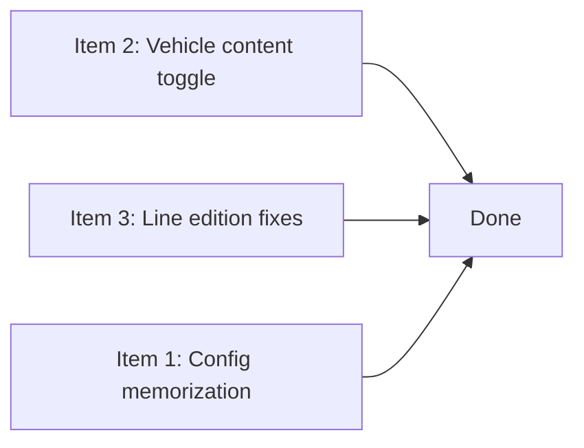

# Details Punchlist Plan

Three independent items from [`docs/next-directions.md`](../docs/next-directions.md#L27) `## Details to add`, lines 29, 35, and 36–40.

---

## 1. Alveoli configuration memorization

**Source:** `docs/next-directions.md:29`
> alveoli configurations (ex storage buffer/allowance) should be able to be memorized, given a name and re-used with a combo-box containing all applicable configurations, "specific" = for this alveoli only or the ability to create a new configuration (no add button, just entering a text in the combo and checking for conflict)

### Current state

- [`StorageConfiguration.tsx`](../apps/browser/src/components/storage/StorageConfiguration.tsx) manages `storageMode`, `storageExceptions`, `storageBuffers` on the alveolus object directly.
- [`SpecificStorageConfiguration.tsx`](../apps/browser/src/components/storage/SpecificStorageConfiguration.tsx) manages per-good buffer stars on `SpecificStorageAlveolusConfiguration.buffers`.
- Both write directly to mutable reactive alveolus properties — there is no abstraction for "save this as a preset."

### Design

#### Data model

Add a new reactive registry at the component level (or a shared store) that holds named configurations. A named configuration is a plain object:

```ts
interface NamedStorageConfig {
  name: string
  storageMode: 'all-but' | 'only'
  storageExceptions: GoodType[]
  storageBuffers: Record<GoodType, number>
  // SpecificStorageConfiguration fields
  specificBuffers?: Record<GoodType, number>
}
```

The combo-box presents options:

| Value | Label |
|-------|-------|
| `"__specific__"` | "Specific (this alveolus only)" |
| `"config:Wood Buffer"` | "Wood Buffer" |
| `"config:Default All"` | "Default All" |
| *user types new name* | "Create '…'" |

#### UX flow

1. User edits buffers/allowances on an alveolus as today.
2. A new row appears: **"Save configuration"** with a [`ComboDropdownPicker`](../apps/browser/src/components/ComboDropdownPicker.tsx) (or similar editable combo).
3. Default selection = `"__specific__"` meaning "no named config, just for this alveolus."
4. User types a name. If the name doesn't collide with an existing config, the option shows as "Create 'name'". Selecting it saves the current alveolus settings under that name.
5. Once saved, the combo now lists all applicable named configurations. Selecting one applies its settings to the alveolus.
6. If the alveolus has a named config loaded, changing settings can be "saved back" to the same name (an explicit save button/action).

#### Files to touch

| File | Changes |
|------|---------|
| [`apps/browser/src/components/storage/StorageConfiguration.tsx`](../apps/browser/src/components/storage/StorageConfiguration.tsx) | Add config combo, save/load logic, config registry |
| [`apps/browser/src/components/storage/SpecificStorageConfiguration.tsx`](../apps/browser/src/components/storage/SpecificStorageConfiguration.tsx) | Expose current buffer values for save/load |
| [`apps/browser/src/lib/storage.ts`](../apps/browser/src/lib/storage.ts) | Possibly add shared config registry if needed across components |

#### i18n keys to add

```
storage.configPreset: "Configuration preset"
storage.configPresetHint: "Save or reuse buffer/allowance setups"
storage.configCreateLabel: "Create '{name}'"
storage.configSpecific: "Specific (this alveolus only)"
storage.configSaveCurrent: "Save current as…"
storage.configNameConflict: "A configuration with this name already exists"
```

---

## 2. Docked vehicle content display

**Source:** `docs/next-directions.md:35`
> find a way to show the content of the docked vehicles. Perhaps add a check-box/button to show/hide vehicle content (docked and non-docked)

### Current state

- [`DockedVehicleList.tsx`](../apps/browser/src/components/DockedVehicleList.tsx) renders [`LinkedEntityControl`](../apps/browser/src/components/LinkedEntityControl.tsx) + [`InspectorObjectLink`](../apps/browser/src/components/InspectorObjectLink.tsx) for each docked vehicle, plus optional line meta.
- [`VehicleProperties.tsx`](../apps/browser/src/components/properties/VehicleProperties.tsx) already has a [`GoodsList`](../apps/browser/src/components/GoodsList.tsx) that renders `vehicle.storage.stock`.
- [`DockedVehicleEntry`](../engines/ssh/src/lib/freight/docked-vehicles.ts:8) contains `vehicle` which has `storage.stock`.

### Design

Add a toggle (checkbox styled as a [`CheckButton`](../apps/browser/src/ui/anarkai/components/CheckButton.tsx)) near the docked vehicle list header. When toggled on, each docked vehicle row expands to show its cargo contents inline.

The inline cargo display reuses the existing [`GoodsList`](../apps/browser/src/components/GoodsList.tsx) component that is already used in [`VehicleProperties.tsx`](../apps/browser/src/components/properties/VehicleProperties.tsx) for the same purpose.

#### Implementation approach

1. Add a `showContent` reactive boolean to [`DockedVehicleList`](../apps/browser/src/components/DockedVehicleList.tsx).
2. Add a `CheckButton` toggle in the header row (or before the list).
3. When `showContent` is true, each row renders a small [`GoodsList`](../apps/browser/src/components/GoodsList.tsx) below the vehicle link, showing `entry.vehicle.storage.stock`.

#### Files to touch

| File | Changes |
|------|---------|
| [`apps/browser/src/components/DockedVehicleList.tsx`](../apps/browser/src/components/DockedVehicleList.tsx) | Add toggle state, render GoodsList per entry when expanded |
| [`apps/browser/src/components/properties/AlveolusProperties.tsx`](../apps/browser/src/components/properties/AlveolusProperties.tsx) | Pass any new props if needed (currently uses `showLineMeta`) |
| [`apps/browser/src/components/HiveProperties.tsx`](../apps/browser/src/components/properties/HiveProperties.tsx) | Same |

#### i18n keys to add

```
vehicle.showContent: "Show cargo"
vehicle.hideContent: "Hide cargo"
```

---

## 3. Line edition widget improvements

**Source:** `docs/next-directions.md:36–40`

Four sub-items:

### 3a. Stop kind sub-menu

> the line stop (bay/zone/...) should only be editable like on add: the set should have a sub-menu (bay/circle/named zone)

**Current:** [`FreightStopCard.tsx`](../apps/browser/src/components/FreightStopCard.tsx) has a 2-option select: `anchor` / `zone`. [`FreightStopList.tsx`](../apps/browser/src/components/FreightStopList.tsx) has a 3-option select: `anchor` / `radius` / `named`.

**Change:** Ensure both UIs consistently show 3 options: **Bay** (anchor), **Radius** (circle zone), **Named zone**. The select becomes the canonical kind-switcher with no hidden options. The sub-menu language from the spec means the kind-select should be prominent and include all three, which the list view already does well — the card view just needs the `named` option added.

**Files:** [`FreightStopCard.tsx`](../apps/browser/src/components/FreightStopCard.tsx) — add `named` option to the select, add handler for named zone kind switch (reuse `setFreightDraftStopKindNamedZone`).

### 3b. Add-stop visibility

> The add stop should allow the selection (indeed, for now it adds something but the change is not visible without refreshing the widget)

**Current:** [`handleAdd`](../apps/browser/src/components/FreightStopList.tsx:232) calls `addFreightDraftStop(draft, draft.stops.length)` which adds a placeholder bay anchor at `[0,0]`. The list should update reactively but may not due to how the draft is managed.

**Root cause likely:** The `currentDraft()` function reads from `props.draft`, and `onChange` passes a new draft object. The reactivity chain may break if the parent doesn't properly propagate the reactive update.

**Fix:** Ensure the `stopsIndexed()` derivation properly tracks changes to `currentDraft()?.stops`. In mutts reactive framework, this may require ensuring the draft reference changes trigger the `for each` re-render. Add `void currentDraft()?.stops.length` as a dependency in the reactive block, or ensure `stopsIndexed()` is a memo that invalidates on stops change.

**Files:** [`FreightStopList.tsx`](../apps/browser/src/components/FreightStopList.tsx) — fix reactivity of `stopsIndexed()`.

### 3c. Widget width / horizontal scroll

> the widget is always a bit too wide and has a horizontal scroll for 1~2px

**Current:** The table uses `table-layout: fixed` with fixed column widths (`.freight-stop-list__index` = 2.2rem, `.freight-stop-list__kind` = 7.5rem, `.freight-stop-list__actions` = 8.25rem). The remaining space goes to the location column. Total fixed = ~18rem, which may overflow a narrow inspector panel.

**Fix:** Reduce fixed widths slightly or use `max-width` constraints. Make the actions column auto-width with `white-space: nowrap`. Ensure the table itself has `width: 100%` and `overflow: hidden` on its container.

**Files:** [`FreightStopList.tsx`](../apps/browser/src/components/FreightStopList.tsx) CSS section — adjust column widths.

### 3d. Zone link button

> the "open zone" button seems quite useless as the stop is shown as a link (it is for the bay and should be for the zone)

**Current:** In [`FreightStopList.tsx`](../apps/browser/src/components/FreightStopList.tsx:349), `InspectorObjectLink` only renders when `tile()` is truthy (which is only for bay anchors). For named zones, there's no link — just a `<span>` with the zone name and a separate "open zone" button at line 399-411.

**Fix:** Add an `InspectorObjectLink` (or equivalent clickable link) for named zone stops, similar to how bay anchors already work. The "open zone" button can then be removed since the link serves the same purpose. For radius zones, the coordinates already show as text (no link possible since there's no zone object).

**Files:**
- [`FreightStopList.tsx`](../apps/browser/src/components/FreightStopList.tsx) — add zone link for named zones, remove or keep the open-zone button as redundant
- [`FreightStopCard.tsx`](../apps/browser/src/components/FreightStopCard.tsx) — also needs similar treatment for consistency

---

## Execution order

The three items are independent and can be worked on in any order:

1. **Item 2 (Docked vehicle content)** — Simplest, least risky, touches only `DockedVehicleList.tsx`
2. **Item 3 (Line edition widget)** — Four small sub-fixes in `FreightStopList.tsx`/`FreightStopCard.tsx`, well-understood
3. **Item 1 (Config memorization)** — Most complex, new data model + combo UI, touches `StorageConfiguration.tsx`


