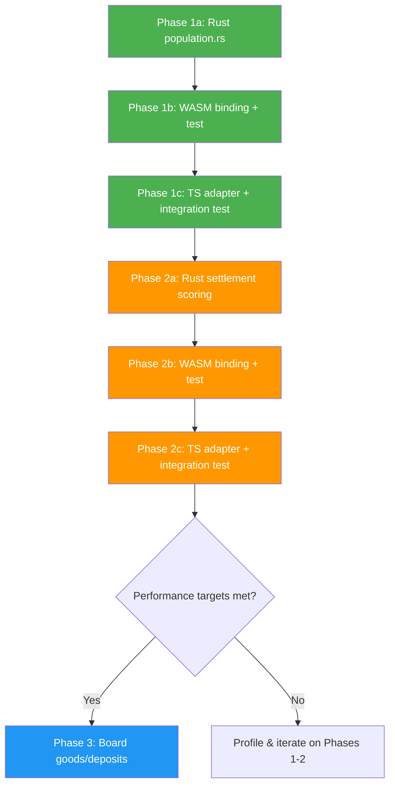

# Rust/WASM Generation Porting Specification

## 1. Overview

This document specifies the architecture, interfaces, and implementation plan for porting
game-generation logic from TypeScript to Rust. Rust becomes the **canonical implementation**;
the TypeScript originals are deleted after validation. All game rules remain in
[`engines/rules/src/`](../engines/rules/src) and are passed to Rust as flat arguments at
call time. Rust performs pure computation with zero game-rule knowledge.

### 1.1 Architectural Principles

1. **Rust is canonical.** No TypeScript fallback. If WASM fails to load, the game cannot
   generate terrain — this is treated as a critical initialization failure, not a soft degrade.
2. **Server-ready purity.** All generation modules are pure functions with zero browser
   dependencies. They must compile under both `wasm32-unknown-unknown` and native
   targets (`x86_64-unknown-linux-gnu`) for future server-side extraction.
3. **Thin WASM wrapper.** The `lib.rs` WASM exports are a thin adapter over pure Rust modules.
   Core generation logic lives in `engine-core` as a library crate, importable by both
   wasm-bindgen and native consumers.
4. **Rules remain TypeScript.** Game constants stay in `engines/rules/` and are serialized
   into flat data at the WASM boundary. No game-rule knowledge exists in Rust.

### 1.2 Goals

| Goal | Priority | Metric |
|---|---|---|
| Eliminate per-frame generation stalls during panning | P0 | No >16ms generation-thread blocking |
| Reduce CPU cost of settlement placement | P1 | >3× faster than current TypeScript |
| Reduce CPU cost of population generation | P1 | >5× faster than current TypeScript |
| Reduce CPU cost of board goods/deposit generation | P2 | >2× faster than current TypeScript |
| Keep `engine-rules` as single source of truth | P0 | Zero rule duplication in Rust |
| Server-side deployable generation | P1 | Pure Rust, no browser deps in core modules |
| Delete TypeScript generation implementations | P2 | After validation, remove dead code |

### 1.2 Existing Rust Infrastructure

The project already has a mature Rust → WASM pipeline:

```
engines/core/
├── Cargo.toml         # wasm-bindgen, serde, rand
├── src/
│   ├── lib.rs         # ~2485 lines, WASM exports
│   ├── common/
│   │   ├── hex.rs     # HexCoord: distance, neighbors, within_radius
│   │   ├── rng.rs     # Rng wrapper
│   │   └── mod.rs
│   ├── noise/
│   │   └── mod.rs     # PerlinNoise, FBM, domain warp
│   └── terrain/
│       ├── mod.rs     # TerrainConfig, TileField
│       ├── biome.rs   # classify_tile, BiomeHint enum
│       ├── affordances.rs  # settlement_suitability, water_access
│       ├── drainage.rs
│       ├── erosion.rs
│       ├── lakes.rs
│       ├── mountains.rs
│       └── continental.rs
```

**Already available in Rust:**
- [`HexCoord`](engines/core/src/common/hex.rs:5) — `distance()`, `neighbors()`, `within_radius()`
- [`PerlinNoise`](engines/core/src/noise/mod.rs) — seeded random noise
- [`TerrainConfig`](engines/core/src/terrain/mod.rs:31) — all terrain generation parameters
- [`settlement_suitability`](engines/core/src/terrain/affordances.rs) — existing terrain scoring function
- Packed array WASM interface pattern — `Int32Array`/`Float32Array` serialization

**WASM loading in TypeScript:**
- [`engines/terrain/src/wasm-loader.ts`](engines/terrain/src/wasm-loader.ts) — central WASM module loader
- Loads via `import('anarkai-core')`; supports both browser (async fetch) and Node/Vitest (initSync)

---

## 2. Architecture: The Rules-as-Arguments Pattern

### 2.1 Crate structure for server-side readiness

```
engines/core/                          # Library crate
├── Cargo.toml                         # [lib] crate-type = ["cdylib", "rlib"]
├── src/
│   ├── lib.rs                         # WASM exports only (thin wrappers)
│   ├── generation/                    # NEW — pure Rust, no wasm_bindgen
│   │   ├── mod.rs                     # shared utilities (no browser deps)
│   │   ├── population.rs              # Phase 1
│   │   ├── settlements.rs             # Phase 2
│   │   └── board.rs                   # Phase 3
│   ├── common/                        # Existing — pure Rust
│   ├── noise/                         # Existing — pure Rust
│   └── terrain/                       # Existing — pure Rust
```

Key design: `generation/` modules have **zero** `#[wasm_bindgen]` annotations. They use
only `std` types (`Vec`, `HashMap`, `HashSet`, `[T]`) and crate-internal types
(`HexCoord`, `Rng`, `PerlinNoise`). They compile natively for server use via
`use engine_core::generation::*` with no code duplication.

The `lib.rs` adds thin `#[wasm_bindgen]` wrappers that unpack typed arrays, call the
pure Rust functions, and repack results. A future server binary calls the same pure
functions directly.

```
┌─────────────────────────────────────────────────────────┐
│ TypeScript (rules owner + orchestrator)                  │
│                                                         │
│  engines/rules/                                         │
│  ├── content/terrain.ts    ──► flatten to arrays        │
│  ├── content/deposits.ts   ──► per-type-id flat arrays  │
│  ├── content/goods.ts      ──► per-good flat arrays     │
│  └── tuning/*.ts           ──► primitive constants      │
│                                                         │
│  engines/ssh/src/lib/generation/                        │
│  ├── index.ts   ← orchestrator, calls WASM              │
│  ├── board.ts   ← calls Rust, TS deleted after validate │
│  ├── settlements.ts ← calls Rust, TS deleted after val  │
│  └── population.ts ← calls Rust, TS deleted after val   │
│                                                         │
└────────────┬────────────────────────────────────────────┘
             │  flat arrays + primitives
             │  (serialized once per call, NOT per tile)
             ▼
┌─────────────────────────────────────────────────────────┐
│ Rust — pure core (engine-core library)                   │
│  generation/{population,settlements,board}.rs            │
│  Zero browser deps. Compiles to native binary too.       │
└────────────┬────────────────────────────────────────────┘
             │  same pure functions
             ▼
┌──────────────────────────┐  ┌──────────────────────────┐
│ lib.rs WASM thin wrappers│  │ Future server binary     │
│ #[wasm_bindgen] exports  │  │ use engine_core::gen::*  │
│ unpacks typed arrays     │  │ native performance       │
└──────────────────────────┘  └──────────────────────────┘
```

### 2.2 Data interchange format

Following the existing WASM pattern in [`lib.rs:898-911`](engines/core/src/lib.rs:898),
all interop uses packed typed arrays:

| Direction | Format | Example |
|---|---|---|
| TS → Rust | `&[i32]` for coords/masks, `&[f64]` for floats | `[q, r, q, r, ...]` |
| TS → Rust | `&[u8]` for terrain/deposit type indices | `[2, 0, 1, 2, ...]` |
| Rust → TS | `Vec<f64>` or `Vec<i32>` or structured JS Object | Return value |
| Rust → TS | JS Object with `Int32Array`/`Float32Array` fields | For large results |

---

## 3. Phase 1: Population Generation

**Source**: [`engines/ssh/src/lib/generation/population.ts`](engines/ssh/src/lib/generation/population.ts:24)

**Complexity**: Low | **Expected speedup**: 5–10× | **Risk**: Minimal

### 3.1 Algorithm

```
INPUT:  seed, character_count, max_radius, min_radius_from_origin, origin,
        tile_coords[], tile_terrains[]
OUTPUT: character_placements[]

1. Filter tiles: terrain ≠ WATER AND distance(origin, tile) ∈ [minR, maxR]
2. Sort by distance to origin (ascending)
3. Iterate character_count times:
     Pick next unused tile; mark used; push to output
4. Return placements as [q, r, q, r, ...]
```

### 3.2 WASM binding signature

```rust
/// Generate character spawn positions.
///
/// # Arguments
/// * `coords` - Packed as [q, r, q, r, ...]
/// * `terrain_kinds` - Packed terrain type indices, one per tile
///    0=water, 1=grass, 2=forest, 3=sand, 4=rocky, 5=snow, 6=concrete
/// * `radius_range` - [min_radius_from_origin, max_radius]
/// * `origin` - [origin_q, origin_r]
///
/// # Returns
/// Packed i32 array [q, r, q, r, ...] for each character position
#[wasm_bindgen]
pub fn wasm_generate_character_positions(
    seed: u32,
    character_count: u32,
    coords: &[i32],
    terrain_kinds: &[u8],
    radius_range: &[i32],  // [min, max]
    origin: &[i32],        // [q, r]
) -> Vec<i32>
```

### 3.3 Rules supplied by TypeScript

| Rule | Source | Rust parameter |
|---|---|---|
| `populationSpawnMaxRadius` | [tuning/characters.ts](engines/rules/src/tuning/characters.ts) | `radius_range[1]` |
| `populationSpawnMinRadiusFromOrigin` | [tuning/characters.ts](engines/rules/src/tuning/characters.ts) | `radius_range[0]` |
| Water terrain exclusion | hardcoded `terrain !== 'water'` | `terrain_kinds[i] != 0` |
| Character naming | stays in TypeScript | — |

### 3.4 TypeScript adapter (in `engines/ssh/src/lib/generation/index.ts`)

```typescript
// Existing GameGenerator gains a method:
async generateCharactersRust(config: GameGenerationConfig, tileData: GeneratedTileData[]): Promise<{ name: string; coord: AxialCoord }[]> {
    const wasm = await loadWasmModule()
    const coords = new Int32Array(tileData.flatMap(t => [t.coord.q, t.coord.r]))
    const terrainKinds = new Uint8Array(tileData.map(t => TERRAIN_KIND_INDEX[t.terrain]))
    const radiusRange = new Int32Array([
        populationSpawnMinRadiusFromOrigin,
        populationSpawnMaxRadius
    ])
    const origin = new Int32Array([config.origin?.q ?? 0, config.origin?.r ?? 0])

    const result = wasm.wasm_generate_character_positions(
        config.terrainSeed, config.characterCount,
        coords, terrainKinds, radiusRange, origin
    )

    const characters = []
    for (let i = 0; i < result.length; i += 2) {
        characters.push({
            name: `Character ${i/2}`,
            coord: { q: result[i], r: result[i+1] }
        })
    }
    return characters
}
```

### 3.5 Rust implementation structure

```rust
// engines/core/src/generation/population.rs

use crate::common::HexCoord;

/// Terrain kind constants matching TypeScript enum
const TERRAIN_WATER: u8 = 0;
// const TERRAIN_GRASS: u8 = 1; // etc.

pub fn generate_character_positions(
    seed: u32,
    character_count: u32,
    coords: &[HexCoord],
    terrain_kinds: &[u8],
    min_radius: i32,
    max_radius: i32,
    origin: HexCoord,
) -> Vec<HexCoord> {
    // 1. Pre-filter eligible tiles with distance
    // 2. Sort by distance (use sort_by_key for stability)
    // 3. Track used positions in a HashSet
    // 4. Walk sorted list, collect up to character_count
    // 5. Return results
}
```

---

## 4. Phase 2: Settlement Generation

**Source**: [`engines/ssh/src/lib/generation/settlements.ts`](engines/ssh/src/lib/generation/settlements.ts:230)

**Complexity**: Medium | **Expected speedup**: 3–5× | **Risk**: Medium (road generation)

### 4.1 Algorithm components

#### A. Settlement scoring
For each tile, compute score based on:
- Terrain type (grass +3, forest +2, sand +1, rocky −1)
- Height penalty: `max(0, 1 − |height| × 2)`
- Water access bonus: +2.5
- Deposit bonus: +1.5
- Neighbor land/water counts
- Random jitter (seeded)

#### B. Settlement placement
1. Sort candidates by score descending
2. Pick highest-scoring tiles while respecting min-spacing (hex distance ≥ N)
3. Assign kind: city (score ≥ 7, first), town (score ≥ 6), village (default)
4. Assign radius: city=4, town=3, village=2

#### C. Zone assignment
For each settlement, for each tile within settlement radius:
- Center (d=0): civic (town/city) or market (village)
- d=1 non-village: market
- Has deposit OR (d ≥ radius−1 AND rocky/forest): industrial
- d ≥ radius AND (grass/forest): harvest
- Default: residential

#### D. Road generation
1. Roads from each settlement center to each neighbor ⚠️ **Requires `straightRoadCoords` from TypeScript**
2. Roads connecting settlements in nearest-neighbor chain
3. River avoidance

### 4.2 CANNOT fully port to Rust

The settlement generator depends on:
- [`straightRoadCoords`](engines/ssh/src/lib/generation/settlements.ts:1) — TypeScript road pathfinding
- [`axial.allTiles`](engines/ssh/src/lib/generation/settlements.ts:277) — expansion utility (Rust has `within_radius`)
- [`axial.neighbors`](engines/ssh/src/lib/generation/settlements.ts:303) — neighbor query (Rust has `neighbors()`)
- [`borderHasRiver`](engines/ssh/src/lib/generation/settlements.ts:197) — requires tile hydrology (complex to serialize)
- Zone definitions — TypeScript-only named zone configs

### 4.3 Recommended approach: partial port

**Port to Rust (Phase 2a):** Settlement scoring + placement (steps A, B)
**Keep in TypeScript (Phase 2b):** Zone assignment + road generation (steps C, D)

This is the 80/20 split: the heaviest computation is scoring/placement, while zone/road is
interactive with game state and not a bottleneck.

### 4.4 WASM binding signature (Phase 2a)

```rust
/// Score and place settlements. Returns settlement metadata; zone assignment
/// and road generation remain in TypeScript.
///
/// # Arguments
/// * `coords` - Packed [q, r, q, r, ...]
/// * `tile_heights` - Float heights per tile
/// * `terrain_kinds` - u8 per tile (0=water, 1=grass, 2=forest, 3=sand, 4=rocky, 5=snow, 6=concrete)
/// * `has_deposit` - u8 per tile (0/1)
/// * `has_hydrology_edge` - u8 per tile indicating river edge presence (0/1)
/// * `options` - [max_settlements, min_spacing, min_score_threshold_scaled]
///
/// # Returns
/// Packed i32 array: for each settlement [center_q, center_r, kind, radius, score_scaled]
/// where kind: 0=village, 1=town, 2=city; score_scaled is score × 100 as integer
#[wasm_bindgen]
pub fn wasm_place_settlements(
    seed: u32,
    coords: &[i32],
    tile_heights: &[f32],
    terrain_kinds: &[u8],
    has_deposit: &[u8],
    has_hydrology_edge: &[u8],
    options: &[i32],      // [max_settlements, min_spacing, min_score_scaled]
) -> Vec<i32>
```

### 4.5 Rules supplied by TypeScript

| Rule | Source | How passed |
|---|---|---|
| Terrain scoring weights | Hardcoded in [settlements.ts:130-148](engines/ssh/src/lib/generation/settlements.ts:130) | Constants in `options` array |
| `maxSettlements` (default 5) | [settlements.ts:242](engines/ssh/src/lib/generation/settlements.ts:242) | `options[0]` |
| `minSpacing` (default 7) | [settlements.ts:244](engines/ssh/src/lib/generation/settlements.ts:244) | `options[1]` |
| Score thresholds for kind | [settlements.ts:153-157](engines/ssh/src/lib/generation/settlements.ts:153) | Hardcoded in Rust |
| Settlement radii | [settlements.ts:159-163](engines/ssh/src/lib/generation/settlements.ts:159) | Hardcoded in Rust |
| `LAND_TERRAINS` set | [settlements.ts:73](engines/ssh/src/lib/generation/settlements.ts:73) | Bitmask or per-tile u8 |
| `INDUSTRIAL_TERRAINS` set | [settlements.ts:74](engines/ssh/src/lib/generation/settlements.ts:74) | Used in TS-only zone step |
| Zone definitions | [settlements.ts:64-71](engines/ssh/src/lib/generation/settlements.ts:64) | Stays in TypeScript |

---

## 5. Phase 3: Board Generation (Goods & Deposits)

**Source**: [`engines/ssh/src/lib/generation/board.ts`](engines/ssh/src/lib/generation/board.ts:268)

**Complexity**: Medium-High | **Expected speedup**: 2–3× | **Risk**: Higher (catalog dependency)

### 5.1 Algorithm

#### Deposit generation per tile
1. Look up terrain → deposit table (e.g., forest → `{tree: 0.7}`)
2. For each deposit type, roll RNG against chance
3. If hit, compute random amount: `(1 + rng × spread) × maxAmount / divisor`

#### Goods generation per tile
1. If deposit exists:
   - Look up deposit → good generation rates
   - Compute equilibrium: `totalRate / decayRate`
   - Apply random variance
2. If terrain has ambient goods:
   - Add random amount per good type

### 5.2 Catalog flattening strategy

Since catalogs are accessed per-tile, we flatten them to **type-id-indexed parallel arrays**:

```typescript
// TypeScript adapter flattens catalogs once per batch:

interface FlattenedCatalogs {
    // Deposit catalog: indexed by deposit_type_id
    depositMaxAmounts: Float64Array      // [18, 18, 12]
    depositGoodTypes: Uint8Array         // which good each deposit generates
    depositGoodRates: Float64Array       // generation rate
    depositRegenerate: Float64Array      // regeneration rate (or 0)

    // Terrain catalog: per terrain_kind (0..6), per deposit_type (0..N)
    // Flattened as: for each terrain, for each deposit, chance
    terrainDepositChances: Float64Array  // [0, 0.7, ...]

    // Goods catalog: indexed by good_type_id
    goodHalfLives: Float64Array
    goodSatiation: Float64Array

    // Tuning constants
    infiniteHalfLifeMultiplier: number
    goodsEquilibriumVariance: number
    depositFillDivisor: number
    depositFillRandomSpread: number
    ambientGoodsMaxPerType: number
}

// Terrain ambient goods: flattened per terrain_kind
terrainAmbientGoods: Uint8Array[][]  // which goods appear ambiently per terrain
```

### 5.3 WASM binding signature

```rust
/// Generate deposits and goods for a batch of tiles.
/// All catalog data is pre-flattened by TypeScript.
///
/// # Returns
/// JS Object with:
/// - depositInts: Int32Array [deposit_type, amount, ...]  (-1 = no deposit)
/// - goodCounts: Uint8Array [count per tile]  (how many goods types)
/// - goodTypes: Uint8Array [good_type, ...]  (concatenated)
/// - goodAmounts: Int32Array [amount, ...]     (concatenated, floor to int)
#[wasm_bindgen]
pub fn wasm_generate_board_deposits_and_goods(
    seed: u32,
    terrain_kinds: &[u8],
    coords: &[i32],                    // for seed derivation per tile
    // Flattened deposit catalog:
    deposit_max_amounts: &[f64],
    deposit_good_types: &[u8],
    deposit_good_rates: &[f64],
    deposit_regenerates: &[f64],
    // Flattened terrain→deposit table:
    terrain_deposit_chances: &[f64],   // [terrain0_dep0, terrain0_dep1, ...]
    terrain_deposit_count: u32,        // deposits per terrain
    // Flattened goods catalog:
    good_half_lives: &[f64],
    // Tuning constants:
    infinite_half_life_multiplier: f64,
    goods_equilibrium_variance: f64,
    deposit_fill_divisor: f64,
    deposit_fill_random_spread: f64,
    ambient_goods_max_per_type: f64,
    // Ambient goods per terrain:
    terrain_ambient_good_types: &[u8], // concatenated, index by terrain_ambient_good_starts
    terrain_ambient_good_starts: &[u32], // start index per terrain
) -> Object  // Returns JS object with typed arrays
```

### 5.4 Complexity assessment

Porting board generation is significantly more complex because:
1. **Catalog flattening is manual and error-prone** — terrain→deposit mapping must be kept in sync
2. **The Rust code must re-derive the same random seeds** as TypeScript for determinism
3. **Benefit is limited** — board generation runs once per sector, not per frame

**Recommendation**: Defer Phase 3 until Phases 1 and 2 prove the pattern works.

---

## 6. Rust Module Structure

```
engines/core/src/
├── lib.rs                      # Add new module + WASM exports
│   # ... existing code ...
│   mod generation;             # NEW
│
│   // NEW WASM exports added near existing terrain exports:
│   // #[wasm_bindgen] pub fn wasm_generate_character_positions(...)
│   // #[wasm_bindgen] pub fn wasm_place_settlements(...)
│   // #[wasm_bindgen] pub fn wasm_generate_board_deposits_and_goods(...)
│
├── generation/
│   ├── mod.rs                  # Re-exports, shared utilities
│   ├── population.rs           # generate_character_positions
│   ├── settlements.rs          # score_settlement_tile, place_settlements
│   └── board.rs                # generate_deposits, generate_goods
│
└── common/
    ├── hex.rs                  # Existing — nothing to add
    ├── rng.rs                  # Existing — may need utility functions
    └── mod.rs
```

### 6.1 Shared utility: deterministic RNG

Both population and settlement generation need seeded RNG keyed by coordinate:

```rust
// engines/core/src/generation/mod.rs

use crate::common::HexCoord;

/// Deterministic hash-based RNG for per-coordinate random values.
/// Matches the TypeScript hashString + random01 pattern.
pub fn coord_hash(seed: u32, coord: &HexCoord, salt: &str) -> u64 {
    // FNV-based hash matching TypeScript implementation
    let mut hash: u64 = 2166136261;
    // Hash seed
    for &byte in seed.to_le_bytes().iter() {
        hash ^= byte as u64;
        hash = hash.wrapping_mul(16777619);
    }
    // Hash coordinate
    for &byte in format!("{},{}", coord.q, coord.r).as_bytes() {
        hash ^= byte as u64;
        hash = hash.wrapping_mul(16777619);
    }
    // Hash salt
    for &byte in salt.as_bytes() {
        hash ^= byte as u64;
        hash = hash.wrapping_mul(16777619);
    }
    hash
}

/// Convert coord_hash to [0, 1) float (matches TS `hashString / 4294967295`)
pub fn random01(hash: u64) -> f64 {
    (hash as f64) / 4294967295.0
}
```

---

## 7. TypeScript Adapter Layer

### 7.1 Location

New adapter functions go in [`engines/ssh/src/lib/generation/index.ts`](engines/ssh/src/lib/generation/index.ts)
alongside existing `GameGenerator` methods. They follow the same async pattern as
`generateSectorsAsync` (line 97).

### 7.2 Terrain kind mapping

```typescript
// Defined once, used by all generation adapters
export const TERRAIN_KIND_TO_INDEX: Record<TerrainType, number> = {
    water: 0, grass: 1, forest: 2, sand: 3, rocky: 4, snow: 5, concrete: 6,
}
```

### 7.3 WASM as canonical implementation

There is no TypeScript CPU fallback. The WASM module is a required dependency for
terrain generation. If it fails to load, the game reports a critical initialization
failure. This follows principle 1 (Rust is canonical) and avoids maintaining duplicate
implementations.

```typescript
// WASM loading is mandatory — no fallback
const wasm = await loadWasmModule()
if (!wasm) throw new Error('Fatal: WASM module failed to load. Generation cannot proceed.')
// ... proceed with WASM calls ...
```

After the Rust implementation is validated against golden tests, the corresponding
TypeScript functions in `population.ts`, `settlements.ts`, and `board.ts` are deleted
to eliminate dead code and prevent accidental divergence.

---

## 8. Testing Strategy

### 8.1 Determinism tests

Each Rust function must produce identical output to TypeScript for the same inputs:

```rust
#[cfg(test)]
mod tests {
    use super::*;

    #[test]
    fn population_determinism_matches_typescript() {
        // Golden test: specific seed + tile data → known output
        let coords = vec![HexCoord::new(0,0), HexCoord::new(1,0), /* ... */];
        let result = generate_character_positions(42, 5, &coords, /* ... */);
        assert_eq!(result, vec![
            HexCoord::new(0, 0), HexCoord::new(1, 0), /* ...expected... */
        ]);
    }
}
```

### 8.2 Integration tests

TypeScript tests verify WASM → TS round-trip:
- Generate with TypeScript → save output
- Generate with WASM → compare tile-by-tile
- Verify seeds produce identical results

### 8.3 Existing test infrastructure

- Rust: `cargo test` in `engines/core/`
- TypeScript: `vitest` with `TestEngine` from [`engines/ssh/tests/test-engine/`](engines/ssh/tests/test-engine/)

---

## 9. Build & Deployment

### 9.1 WASM build

```bash
cd engines/core
wasm-pack build --target web --out-dir pkg
```

The existing [`Cargo.toml`](engines/core/Cargo.toml) already has:
- `crate-type = ["cdylib", "rlib"]` — WASM + native lib
- `wasm-bindgen = "0.2"` — JS interop
- `opt-level = "s"` — size-optimized release

### 9.2 TypeScript integration

The `anarkai-core` package is already a workspace dependency (see
[`engines/terrain/package.json:15`](engines/terrain/package.json:15)). Generation
adapters import via the same `import('anarkai-core')` pattern.

### 9.3 No new dependencies required

All needed crates are already in `Cargo.toml`:
- `wasm-bindgen`, `js-sys` — WASM interop
- `serde`, `serde-wasm-bindgen` — serialization
- `rand`, `rand_chacha` — RNG (for board goods/deposits)

---

## 10. Implementation Sequence



### 10.1 Phase 1 detailed steps

| Step | File | Description |
|---|---|---|
| 1.1 | `engines/core/src/generation/mod.rs` | Create module, implement `coord_hash` + `random01` |
| 1.2 | `engines/core/src/generation/population.rs` | Implement `generate_character_positions` |
| 1.3 | `engines/core/src/lib.rs` | Add `mod generation` and `#[wasm_bindgen]` export |
| 1.4 | Rust test | Golden test verifying output matches TypeScript |
| 1.5 | Build | `wasm-pack build` to generate new WASM |
| 1.6 | `engines/ssh/src/lib/generation/index.ts` | Add `generateCharactersRust` method |
| 1.7 | Integration test | Compare WASM vs TypeScript output |

### 10.2 Phase 2 detailed steps

| Step | File | Description |
|---|---|---|
| 2.1 | `engines/core/src/generation/settlements.rs` | Implement tile scoring + placement |
| 2.2 | `engines/core/src/lib.rs` | Add `#[wasm_bindgen]` export for settlements |
| 2.3 | Rust test | Golden test for settlement placement |
| 2.4 | Build | Rebuild WASM |
| 2.5 | `engines/ssh/src/lib/generation/settlements.ts` | Add `generateSettlementPlacementsRust` |
| 2.6 | Adapter | Splice Rust results into existing zone/road pipeline |
| 2.7 | Integration test | Full settlement generation round-trip |

### 10.3 Phase 3 (deferred)

Only proceed if profiling shows board generation is still a bottleneck after Phases 1–2.

### 10.4 Post-implementation cleanup

After each phase is validated:
- Delete the TypeScript implementation from `engines/ssh/src/lib/generation/*.ts`
- Remove corresponding exports from `engines/ssh/src/lib/generation/index.ts`
- Verify no imports of the deleted functions remain
- Remove now-unused `PopulationGenerator` class / `BoardGenerator` methods

---

## 10bis. Server-Side Compatibility Requirements

### Core module constraints

Every `pub fn` in `engines/core/src/generation/` must satisfy:

1. **No `#[wasm_bindgen]`** — annotations belong in `lib.rs` wrappers only
2. **No `js_sys`, `web_sys`, `wasm_bindgen` imports** — these are browser-only
3. **All inputs are owned or `Copy`** — `HexCoord`, `i32`, `f64`, `&[T]`, `Vec<T>`
4. **All outputs are `Vec<T>` or crate types** — no `JsValue` or `Object`
5. **No `format!` in hot loops** — use `write!` into pre-allocated `String` if needed
6. **Deterministic RNG** — use crate `Rng` wrapper, not `rand::thread_rng()`

### Compilation verification

```bash
# Verify native compilation (no wasm deps in generation/)
cargo check --target x86_64-unknown-linux-gnu -p anarkai-core

# Verify WASM compilation (full crate including wrappers)
cargo check --target wasm32-unknown-unknown -p anarkai-core
```

### Future server extraction path

```
engines/core/              → extracted as standalone crate
  src/generation/          → used directly by server binary
  src/common/              → shared hex/rng utilities
  src/terrain/             → shared terrain config/classification

engines/terrain/           → stays browser-only (GPU fields, WebGPU)
engines/rules/             → serialized to flat data for server consumption
engines/ssh/               → stays browser-only (game state, Pixi)
```

---

## 11. Risk Analysis

| Risk | Likelihood | Impact | Mitigation |
|---|---|---|---|
| WASM load failure (no fallback) | Low | Critical | WASM is bundled with app; load failures trigger visible error. CI gates WASM build. |
| Determinism mismatch with TS | Medium | High | Golden tests + integ tests for every function |
| Catalog flattening bugs (Phase 3) | High | Medium | Defer Phase 3; extensive type-checking in adapter |
| Performance not worth complexity | Low | Low | Profiling gates each phase; stop if <2× speedup |
| Rust code maintenance burden | Medium | Medium | Keep Rust pure-compute; all game logic stays in TS |
| Build pipeline breakage | Low | High | Existing `wasm-pack` pipeline is well-tested |
| Server extraction breaks due to browser deps | Medium | Medium | `generation/` modules forbidden from using `js_sys`, `web_sys`, `wasm_bindgen` |

---

## 12. Success Criteria

- [ ] `wasm_generate_character_positions` produces identical output to `PopulationGenerator.generateCharacters`
- [ ] `wasm_place_settlements` produces identical settlement positions to `generateSettlementZonePlan` (steps A+B)
- [ ] All existing TypeScript tests pass unchanged
- [ ] No new dependencies added to any package.json
- [ ] WASM generation calls complete in <2ms for typical sector sizes
- [ ] Panning at zoomed-out levels feels smooth (no visible generation stalls)
