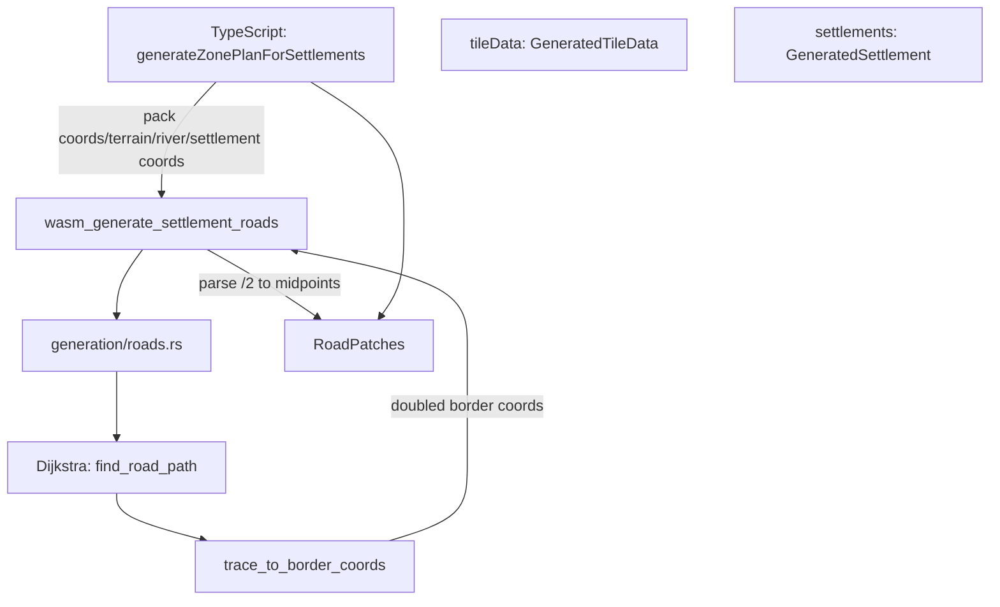

# Rust Road Generation — Architecture & Implementation Plan

## 1. Overview

Move NPC settlement-to-settlement road generation from TypeScript to Rust/WASM,
replacing the current straight-line trace with a weighted Dijkstra pathfinder that
reuses existing roads and handles rivers gracefully.

### 1.1 Current State (TypeScript)

- [`engines/ssh/src/lib/generation/settlements.ts:138-222`](../engines/ssh/src/lib/generation/settlements.ts:138)
  — `generateZonePlanForSettlements()`
- Uses [`straightRoadCoords()`](../engines/ssh/src/lib/board/roads.ts:29) (linear
  hex interpolation) for road traces — no pathfinding
- Local roads: settlement center → each neighbor
- Inter-settlement roads: each settlement → nearest already-processed settlement
- River borders are skipped (road stops at river)

### 1.2 Target State (Rust + WASM)

- Pure Rust module `engines/core/src/generation/roads.rs`
- Weighted Dijkstra pathfinding with:
  - **Base cost = 1.0** per border crossing
  - **Road-reuse discount = 0.1** for borders that already have roads (prevents near-parallel roads)
  - **Water = impassable** (infinite cost)
  - **River = 10.0** penalty — Dijkstra naturally explores ~10 non-river tiles before crossing a river
- No separate detour post-processing — the 10.0 river penalty means Dijkstra itself finds the best crossing
- WASM binding in `lib.rs`
- TypeScript deletes the road-trace generation in `settlements.ts` and calls WASM instead

---

## 2. Architecture

```
┌──────────────────────────────────────────────────────────────────┐
│ TypeScript (orchestrator)                                         │
│   settlements.ts: generateZonePlanForSettlements()                │
│   └► Calls WASM for zone assignment (existing)                   │
│   └► Calls WASM for road generation  (NEW)                        │
│       Input:  coords[], terrain_kinds[], has_river[],             │
│               settlement_centers[]                                │
│       Output: packed i32[] of doubled border coordinates          │
│                → TS splits into RoadPatches format                │
└────────────┬─────────────────────────────────────────────────────┘
             │  Int32Array, Uint8Array
             ▼
┌──────────────────────────────────────────────────────────────────┐
│ lib.rs (WASM thin wrapper)                                        │
│   wasm_generate_settlement_roads(seed, coords, terrain_kinds,     │
│     has_river, settlement_centers) → Vec<i32>                     │
└────────────┬─────────────────────────────────────────────────────┘
             │  calls pure Rust
             ▼
┌──────────────────────────────────────────────────────────────────┐
│ generation/roads.rs (pure Rust, zero WASM deps)                   │
│   generate_settlement_roads()                                     │
│   ├─ settlements_to_roads()     — main orchestrator               │
│   ├─ find_road_path()           — weighted Dijkstra               │
│   └─ trace_to_border_coords()   — tile trace → border midpoints   │
└──────────────────────────────────────────────────────────────────┘
```

### 2.1 Why Dijkstra, not A*

- The edge weights are not uniform Euclidean distances — road-reuse makes an
  existing road border cost 0.1 while a normal border costs 1.0
- Dijkstra naturally handles arbitrary edge weights
- The hex grid is small (typically hundreds to low thousands of tiles)
- No meaningful heuristic exists when road reuse creates "negative" shortcuts

---

## 3. Rust Module Design

### 3.1 File: `engines/core/src/generation/roads.rs`

```rust
//! Settlement road generation via weighted pathfinding.
//!
//! Pure Rust — zero WASM dependencies. Compiles for both wasm32 and native targets.

use crate::common::HexCoord;
use std::collections::{BinaryHeap, HashMap, HashSet};

/// Internal node for Dijkstra priority queue.
#[derive(Clone, Debug)]
struct PathNode {
    coord: HexCoord,
    cost: f64,
    parent: Option<HexCoord>,
}

impl PartialEq for PathNode {
    fn eq(&self, other: &Self) -> bool {
        self.cost == other.cost && self.coord == other.coord
    }
}

impl Eq for PathNode {}

impl Ord for PathNode {
    fn cmp(&self, other: &Self) -> std::cmp::Ordering {
        other.cost.partial_cmp(&self.cost)
            .unwrap_or(std::cmp::Ordering::Equal)
            .then_with(|| self.coord.q.cmp(&other.coord.q))
            .then_with(|| self.coord.r.cmp(&other.coord.r))
    }
}
impl PartialOrd for PathNode {
    fn partial_cmp(&self, other: &Self) -> Option<std::cmp::Ordering> {
        Some(self.cmp(other))
    }
}
```

### 3.2 Core Function: `generate_settlement_roads`

```rust
/// Generate road borders between settlements using weighted pathfinding.
///
/// # Arguments
/// * `seed`          - Deterministic seed (reserved for future tie-breaking)
/// * `coords`        - Slice of all tile coordinates
/// * `terrain_kinds` - Terrain type per tile (0=water, 1=plains, 2=forest, ...)
/// * `has_river`     - River presence flag per tile (0=no, 1=yes; includes
///                      river edges OR channel tile OR bank influence)
/// * `settlement_coords` - Settlement center coordinates (ordered high→low score)
///
/// # Returns
/// * `Vec<(i32, i32)>` — doubled border-midpoint coordinates
///   (e.g., border between (0,0) and (1,0) → [(1, 0)])
///   Caller divides by 2 to get midpoint storage format.
pub fn generate_settlement_roads(
    seed: u32,
    coords: &[HexCoord],
    terrain_kinds: &[u8],
    has_river: &[u8],
    settlement_coords: &[HexCoord],
) -> Vec<(i32, i32)> { ... }
```

### 3.3 Weighted Dijkstra: `find_road_path`

```rust
/// Find the lowest-cost path from start to goal using Dijkstra.
///
/// Edge weights:
///   - Water:                           ∞ (impassable)
///   - Normal border:                   1.0
///   - Already-roaded border:           0.1
///   - River border (either tile):     10.0
///
/// The 10.0 river penalty means Dijkstra will explore up to ~10 non-river
/// tiles before choosing a river crossing. This naturally handles the
/// "try to find a crossing within a radius, then give up" behavior.
fn find_road_path(
    start: &HexCoord,
    goal: &HexCoord,
    tile_index: &HashMap<HexCoord, usize>,
    terrain_kinds: &[u8],
    has_river: &[u8],
    existing_road_borders: &HashSet<(i32, i32)>, // keyed by doubled-coord hash
) -> Option<Vec<HexCoord>> { ... }
```

**Border identification key:**
```rust
/// Returns a stable key for the border between two adjacent hexes.
/// Uses doubled coordinates so all border midpoints are integers.
fn border_key(a: &HexCoord, b: &HexCoord) -> (i32, i32) {
    // doubled midpoint: (a.q + b.q, a.r + b.r) — always even integer
    (a.q + b.q, a.r + b.r)
}
```

**Edge cost computation:**
```rust
/// Compute the cost of crossing the border between tile `a` and tile `b`.
/// Both tiles must exist in tile_index.
fn border_cost(
    a: &HexCoord,
    b: &HexCoord,
    tile_index: &HashMap<HexCoord, usize>,
    terrain_kinds: &[u8],
    has_river: &[u8],
    existing_road_borders: &HashSet<(i32, i32)>,
) -> f64 {
    let a_idx = tile_index[a];
    let b_idx = tile_index[b];

    // Water is impassable
    if terrain_kinds[a_idx] == 0 || terrain_kinds[b_idx] == 0 {
        return f64::INFINITY;
    }

    let key = border_key(a, b);

    // Existing road → huge discount
    if existing_road_borders.contains(&key) {
        return 0.1;
    }

    // River penalty for either tile
    if has_river[a_idx] == 1 || has_river[b_idx] == 1 {
        return 10.0;
    }

    1.0
}
```

### 3.4 Trace-to-Border Conversion: `trace_to_border_coords`

```rust
/// Convert a tile-center trace to doubled border-midpoint coordinates.
///
/// trace = [tile0, tile1, tile2] → borders = [(t0_q+t1_q, t0_r+t1_r), (t1_q+t2_q, t1_r+t2_r)]
fn trace_to_border_coords(trace: &[HexCoord]) -> Vec<(i32, i32)> {
    let mut borders = Vec::with_capacity(trace.len().saturating_sub(1));
    for i in 1..trace.len() {
        let a = &trace[i - 1];
        let b = &trace[i];
        borders.push((a.q + b.q, a.r + b.r));
    }
    borders
}
```

### 3.5 Main Orchestrator: `settlements_to_roads`

```rust
/// Generate all road borders for a set of settlements.
///
/// Algorithm:
/// 1. For each settlement, add roads from center to all valid neighbors
///    (same as current TS behavior).
/// 2. For each settlement i (1..n), find the nearest already-processed
///    settlement, then find a weighted path between them via Dijkstra.
/// 3. Convert each path to border coordinates.
/// 4. The order respects the road-reuse discount: roads from earlier pairs
///    make later pairs cheaper to route along.
fn settlements_to_roads(
    seed: u32,
    tile_index: &HashMap<HexCoord, usize>,
    terrain_kinds: &[u8],
    has_river: &[u8],
    settlement_coords: &[HexCoord],
) -> Vec<(i32, i32)> {
    let mut all_road_borders: HashSet<(i32, i32)> = HashSet::new();

    // Step 1: Local roads (center → neighbors)
    for center in settlement_coords {
        let Some(&c_idx) = tile_index.get(center) else { continue; };
        for neighbor in center.neighbors() {
            let Some(&n_idx) = tile_index.get(&neighbor) else { continue; };
            if terrain_kinds[n_idx] == 0 { continue; } // skip water
            let key = border_key(center, &neighbor);
            // Skip if either tile has a river
            if has_river[c_idx] == 1 || has_river[n_idx] == 1 { continue; }
            all_road_borders.insert(key);
        }
    }

    // Step 2: Inter-settlement roads
    for i in 1..settlement_coords.len() {
        let current = &settlement_coords[i];
        // Find nearest previous settlement
        let previous = settlement_coords[0..i]
            .iter()
            .min_by_key(|s| s.distance(current))
            .unwrap();

        // Find weighted path using Dijkstra
        if let Some(path) = find_road_path(
            previous, current,
            tile_index, terrain_kinds, has_river,
            &all_road_borders,
        ) {
            let borders = trace_to_border_coords(&path);
            all_road_borders.extend(borders);
        }
    }

    // Return sorted for determinism
    let mut result: Vec<_> = all_road_borders.into_iter().collect();
    result.sort();
    result
}
```

---

## 4. WASM Binding

### 4.1 In `engines/core/src/lib.rs`

```rust
/// Generate settlement road borders using weighted pathfinding.
///
/// # Arguments
/// * `seed`               - Deterministic seed
/// * `coords`             - Packed as [q, r, q, r, ...]
/// * `terrain_kinds`      - u8 per tile (0=water, 1=plains, 2=forest, ...)
/// * `has_river`          - u8 per tile (0 or 1)
/// * `settlement_coords`  - Packed as [q, r, ...] in score-descending order
///
/// # Returns
/// Packed i32 array of doubled border coordinates: [bq, br, bq, br, ...]
/// TypeScript divides each by 2 to get midpoint storage format.
///
/// # Note on rivers
/// River borders carry a 10.0 cost in Dijkstra. This means the pathfinder
/// will explore up to ~10 non-river tiles before choosing a river crossing.
/// No separate detour post-processing is needed.
#[wasm_bindgen]
pub fn wasm_generate_settlement_roads(
    seed: u32,
    coords: &[i32],
    terrain_kinds: &[u8],
    has_river: &[u8],
    settlement_coords: &[i32],
) -> Vec<i32> { ... }
```

**Implementation:**
1. Unpack `coords` into `Vec<HexCoord>` (pairs of i32)
2. Unpack `settlement_coords` into `Vec<HexCoord>` (pairs of i32)
3. Build `HashMap<HexCoord, usize>` tile index
4. Call `generation::roads::generate_settlement_roads(seed, &coords, terrain_kinds, has_river, &settlement_coords)`
5. Flatten result into `Vec<i32>`: `[q, r, q, r, ...]`

---

## 5. TypeScript Changes

### 5.1 In `engines/ssh/src/lib/generation/settlements.ts`

**Before** (current, lines 166–193):
```typescript
const roadSet = new Set<string>()
const roadTileKeys = new Set<string>()
const addRoadTrace = (from: AxialCoord, to: AxialCoord) => {
    const trace = straightRoadCoords(from, to).filter((coord) => tiles.has(tileKey(coord)))
    // ... straight-line trace logic
}
for (const settlement of settlements) {
    for (const coord of axial.neighbors(settlement.center)) {
        if (tiles.has(tileKey(coord))) addRoadTrace(settlement.center, coord)
    }
}
for (let i = 1; i < settlements.length; i++) {
    const settlement = settlements[i]!
    const previous = nearestPrevious(settlements, i)
    if (previous) addRoadTrace(previous.center, settlement.center)
}
```

**After** — replaced with WASM call:
```typescript
// Build inputs for WASM (coords, terrainKinds, hasRiver already
// prepared earlier for the settlement placement call — reuse them)
const settlementCoords = new Int32Array(settlements.length * 2)
for (let i = 0; i < settlements.length; i++) {
    settlementCoords[i * 2] = settlements[i]!.center.q
    settlementCoords[i * 2 + 1] = settlements[i]!.center.r
}

// Call WASM for road generation
const { wasm_generate_settlement_roads } = await import('anarkai-core')
const packed = wasm_generate_settlement_roads(
    seed, coords, terrainKinds, hasRiver, settlementCoords
)

// Parse: doubled borders → midpoint format
const roadSet = new Set<string>()
for (let i = 0; i < packed.length; i += 2) {
    const dq = packed[i]!, dr = packed[i + 1]!
    roadSet.add(`${dq / 2},${dr / 2}`)
}
```

### 5.2 `generateZonePlanForSettlements` changes

The function must become `async` since it now calls WASM. The road generation
block (lines 166–193) is replaced with the WASM call above. Zone assignment
logic remains unchanged TypeScript.

### 5.3 Data reuse from settlement placement

The `coords`, `terrainKinds`, and `hasRiver` typed arrays are already built
for the `wasm_place_settlements` call in `placeSettlements()` (see
[`index.ts:543-600`](../engines/ssh/src/lib/generation/index.ts:543)).
These same arrays can be reused for the road generation call — no duplicate
preparation needed.

---

## 6. Hydrology Data Preparation

Current TypeScript code preparing `hasRiver` for settlement placement
([`index.ts:575-581`](../engines/ssh/src/lib/generation/index.ts:575)):

```typescript
hasRiver[i] =
    tile.hydrology?.isChannel ||
    (tile.hydrology?.bankInfluence ?? 0) > 0 ||
    Object.keys(tile.hydrology?.edges ?? {}).length > 0
        ? 1 : 0
```

The river propagation to neighbors ([`index.ts:587-600`](../engines/ssh/src/lib/generation/index.ts:587))
already marks adjacent tiles as having river influence. For road pathfinding,
the Rust code checks both tiles touching a border in `border_cost()`: if either
has `has_river == 1`, the border gets the 10.0 penalty.

---

## 7. Implementation Steps

### Step 1: Create `generation/roads.rs` (pure Rust)

- [`engines/core/src/generation/roads.rs`](../engines/core/src/generation/roads.rs)
  — **NEW FILE**
- Implement `PathNode`, `border_key()`, `border_cost()`
- Implement `find_road_path()` — weighted Dijkstra
- Implement `trace_to_border_coords()` — tile trace → borders
- Implement `settlements_to_roads()` — orchestrator
- Implement `generate_settlement_roads()` — public API
- Add `#[cfg(test)] mod tests` with unit tests:
  - Two adjacent tiles → single border
  - Water avoidance: path routes around water
  - River penalty: path prefers non-river route up to ~10 tiles
  - Road reuse: second path reuses first path's borders (cost 0.1)
  - No path possible → returns None
  - Single settlement → only local roads

### Step 2: Register in `generation/mod.rs`

- Add `pub mod roads;`
- Add re-exports: `pub use roads::generate_settlement_roads;`

### Step 3: Add WASM binding in `lib.rs`

- Implement `wasm_generate_settlement_roads()`
- Unpack typed arrays → call pure Rust → pack result

### Step 4: Build WASM and verify compilation

```bash
cd engines/core && wasm-pack build --target web
```

### Step 5: Modify TypeScript `settlements.ts`

- Make `generateZonePlanForSettlements` async
- Replace road generation block (lines 166–193) with WASM call
- Parse doubled border coordinates into the existing `RoadPatches` format
- Reuse `coords`/`terrainKinds`/`hasRiver` arrays already built for settlement placement

### Step 6: Add integration tests

- [`engines/ssh/src/lib/generation/settlements.spec.ts`](../engines/ssh/src/lib/generation/settlements.spec.ts)
  — add road-specific tests
- Test cases:
  - Basic: settlements connected via shortest path
  - Road reuse: second settlement reuses first's road
  - Water avoidance: roads route around lakes
  - River behavior: roads avoid rivers when reasonable, cross when necessary
  - Determinism: same seed → identical roads

### Step 7: Validate against existing test suite

- Run `engines/ssh` tests: `npx vitest run engines/ssh`
- Run `engines/core` tests: `cargo test`

---

## 8. File Change Summary

| File | Action | Description |
|------|--------|-------------|
| `engines/core/src/generation/roads.rs` | **CREATE** | Pure Rust road pathfinding |
| `engines/core/src/generation/mod.rs` | **MODIFY** | Add `pub mod roads;` + re-export |
| `engines/core/src/lib.rs` | **MODIFY** | Add `wasm_generate_settlement_roads` |
| `engines/ssh/src/lib/generation/settlements.ts` | **MODIFY** | Replace TS road gen with WASM call; make async |
| `engines/ssh/src/lib/generation/settlements.spec.ts` | **MODIFY** | Add road integration tests |

---

## 9. Data Flow Diagram



---

## 10. Edge Cases & Behavior

| Scenario | Behavior |
|----------|----------|
| All water between settlements | No path found → no road segment between them |
| River between settlements | Dijkstra explores up to ~10 non-river tiles first; crosses river only if no alternative exists within that range |
| Wide river with no crossing | Road crosses at lowest-cost point (minimal decor case — road stops at the river, two disconnected segments) |
| Road already exists on optimal path | Discounted to 0.1 → pathfinder naturally follows existing roads, preventing near-parallel roads |
| Settlement on island (water neighbors) | Local roads only to non-water neighbors; if none, no local roads |
| Empty tile set | Returns empty Vec |
| Single settlement | Only local roads (center → neighbors), no inter-settlement paths |
| River at settlement center tile | Local roads still drawn to non-river non-water neighbors |
